# Lab 00: Environment Setup - Zava Corporation AI Agent Infrastructure

## Estimated time: 30 Minutes

## Introduction

**Zava Corporation** is a mid-sized financial services and HR consulting firm operating across the UK and EU. Zava manages sensitive employee records, client financial data, and third-party vendor contracts. The organisation has recently deployed AI agents across its HR, Finance, and IT Support functions to improve operational efficiency.

Before any security configuration can begin, the Zava Corporation environment must be fully provisioned. In this lab, you will configure the Microsoft Entra ID tenant, enable Microsoft Copilot Studio, register the security group required for agent authoring, create the three AI agents that serve as governance targets throughout the entire course, connect each agent to its designated SharePoint knowledge source, and upload the sample business documents that simulate Zava's live data environment.

Every subsequent lab depends on the agents, identities, and files created here. Complete all three exercises in order before proceeding to Lab 01.

> **Note:** In a real-world environment, responsibilities like these would be distributed across multiple personas - developers, IT administrators, security administrators, and compliance officers - each operating with scoped permissions aligned to the principles of least privilege and Zero Trust.

## Objectives

- Create a role-assignable security group in Microsoft Entra ID and assign it the Privileged Role Administrator role.
- Enable the **copilotagentsecurity** group as the authorised Copilot Studio Authors group in Power Platform Admin Center.
- Enable Entra Agent Identity for Copilot Studio at the environment level.
- Connect SharePoint as a data source in the Power Apps maker portal.
- Create three Copilot Studio agents: Zava HR Assistant, Zava Finance Agent, and Zava IT Support Agent.
- Connect each agent to its designated SharePoint knowledge source.
- Publish each agent and share it with the appropriate lab users.
- Upload Zava sample business documents to the HR and Finance SharePoint sites.
- Verify that all three agents appear as Active in the Microsoft Agent 365 Agent Registry.

## Exercise 0: Create the Zava HR SharePoint Site

1. Open a new browser tab and enter the following URL to navigate to the **Microsoft Entra admin center** portal. 

    ```
	https://admin.microsoft.com
	```

1. Sign in with following  credentials:

	- **Email/Username:** **<inject key="AzureAdUserEmail"></inject>**

	- **Password:** **<inject key="AzureAdUserPassword"></inject>**

1. Click **Show all** from the left navigation pane to expand and display all available administration options in the Microsoft 365 admin center.

     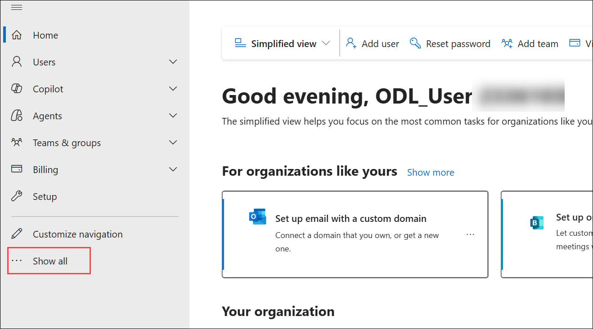

1. From the left navigation pane, select **SharePoint** under **Admin centers**.

	

1. In the SharePoint admin center, from the left navigation pane, expand **Sites (1)** and select **Active sites (2)**. Then, click **+ Create (3)**.

	

1. On the **Create a site** panel, select **Team site**.

	

1. On the **Select a template** page, select **Standard team**.

	

1. On the **Preview and use 'Standard team' template** page, select **Use template**.

	

1. On the **Team site** configuration page, enter the following details and click on **Next (4)**:

    - **Site name:** **HR<inject key="Deployment ID" enableCopy="false"></inject> (1)**

    - **Site address:** Confirm the URL path reads **/sites/HR<inject key="Deployment ID" enableCopy="false"></inject> (2)**

    - **Group Owner:** **ODL_User <inject key="Deployment ID" enableCopy="false"></inject> (3)**

	   

1. Add the following details and click on **Create site (3)**:

    - **Privacy settings:** Select **Private - only members can access this site (1)**.

    - **Select a language:** **English (2)**

		

1. On the **Add site owners and members** blade, select **Patti Fernandes (1)** by searching her name and selecting it from the dropdown, then click **Finish (2)**.

	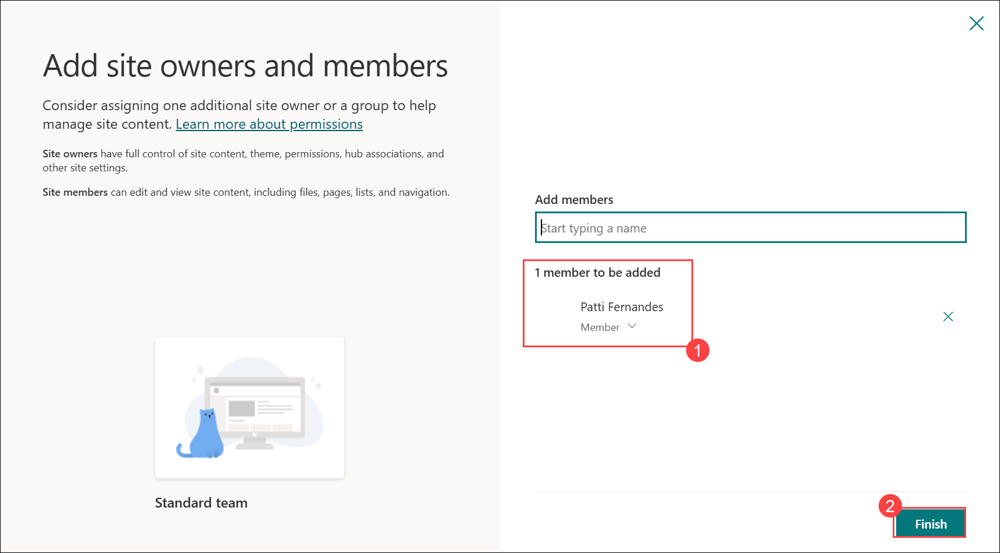

1. Once the site is provisioned, select **Active sites (1)**, and verify that the HR site appears in the list. Click on the URL ending in **/sites/HR<inject key="Deployment ID" enableCopy="false"></inject> (2)**.

	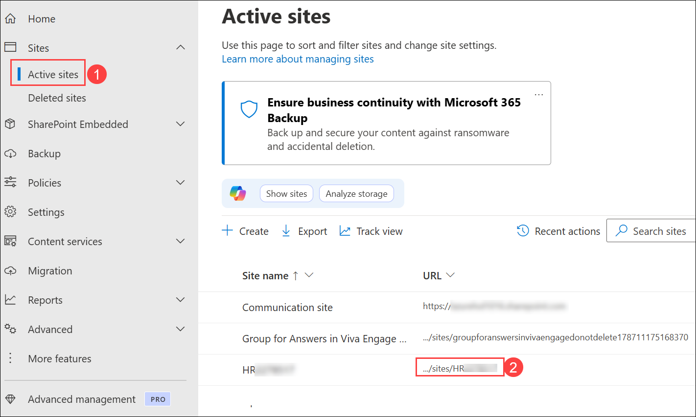

1. Verify that the **HR SharePoint site** is open, then **copy the site URL** from the browser address bar and **paste it in the Notepad.** 

1. Ensure the URL contains **https://[TenantPrefix].sharepoint.com/sites/HR<inject key="Deployment ID" enableCopy="false"></inject>**, as it will be used in later steps.

	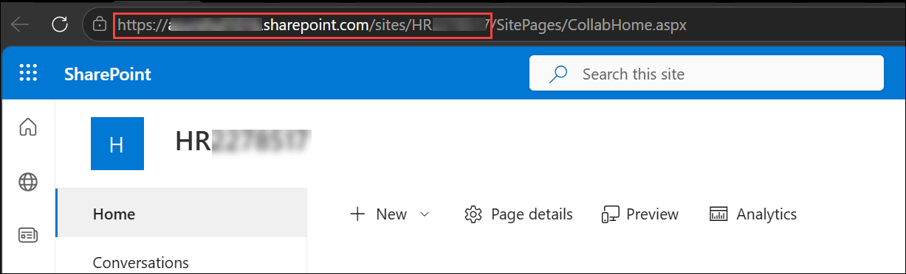

     > **Note:** This site serves as the SharePoint knowledge source for the **Zava HR Assistant** agent that will be created in **Lab 00, Exercise 2**. The Copilot Studio connection specifically references **/sites/HR<inject key="Deployment ID" enableCopy="false"></inject>**, so ensure that the site URL matches exactly.

1. Repeat **Steps 5 - 11** to create another site using the following details:

    - **Site name:** **Operations<inject key="Deployment ID" enableCopy="false"></inject>**

    - **Site address:** Confirm the URL path reads **/sites/Operations<inject key="Deployment ID" enableCopy="false"></inject>**

    - **Group Owner:** **ODL_User <inject key="Deployment ID" enableCopy="false"></inject>**

    - **Privacy settings:** Select **Private**.

    - **Select a language:** English.

1. Once the site is provisioned, select **Active sites (1)**, and verify that the Operations site appears in the list. Click on the URL ending in **/sites/Operations<inject key="Deployment ID" enableCopy="false"></inject> (2)**.

	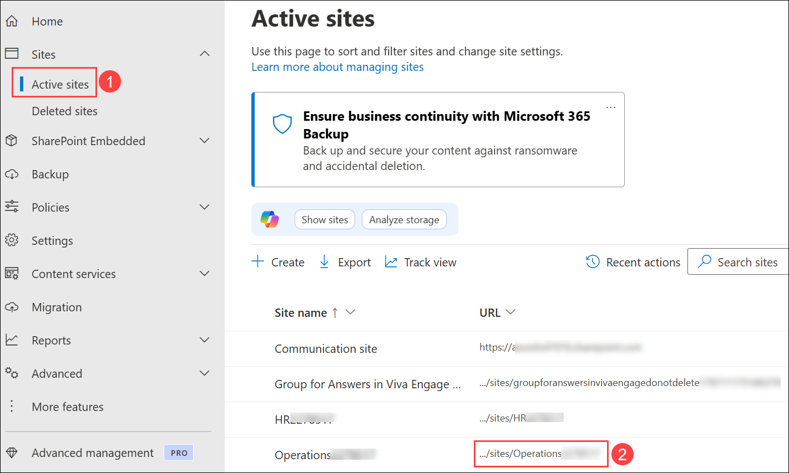

1. Verify that the **Operations SharePoint site** is open, then **copy the site URL** from the browser address bar and **paste it in the Notepad.** 

1. Ensure the URL contains **https://[TenantPrefix].sharepoint.com/sites/Operations<inject key="Deployment ID" enableCopy="false"></inject>**, as it will be used in later steps.

	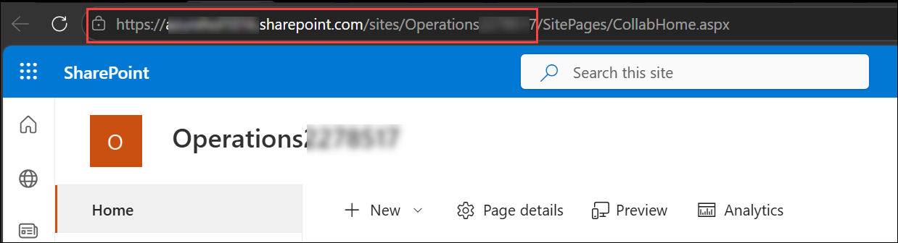	

## Exercise 1: Configure Entra ID and Enable Copilot Studio Authors

### Task 1: Sign In and Configure Multi-Factor Authentication

1. Open a new tab and navigate to `https://entra.microsoft.com`.

2. On the sign-in page, enter the **ODL User** credentials from the **Environment** tab of your lab environment if prompted:
	- **Email/Username:** <inject key="AzureAdUserEmail"></inject>

	  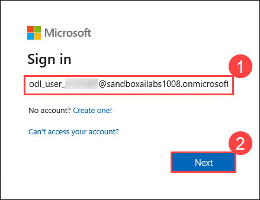

	- **Temporary Access Pass:** <inject key="AzureAdUserPassword"></inject>

	  

1. If asked **Stay signed in?**, select **Yes**.

	

1. On the Microsoft Entra admin center welcome screen, select **Get Started**.

### Task 2: Create the copilotagentsecurity Security Group

1. In the Microsoft Entra admin center, in the left navigation pane, expand **Entra ID** and select **Groups**.

	

1. On the **Overview** page, select **New group**.

	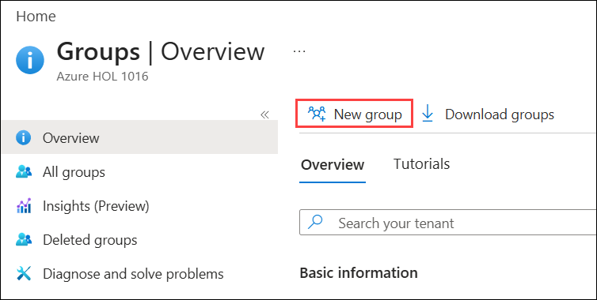

1. On the **New Group** page, enter the following details:

    - **Group type:** Select **Security (1)**

    - **Group name:** Enter **`copilotagentsecurity`(2)**

    - **Microsoft Entra roles can be assigned to the group:** Select **Yes (3)**. 
   
       >**Note:** If this option is not visible, skip this field and continue.

    - **Owners:** click **No owners selected (4)**.	  

		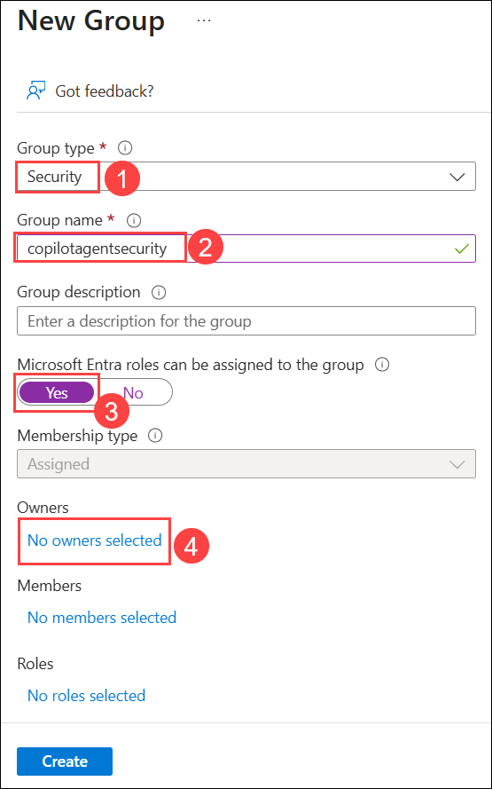

1. On the **Add owners** panel, search for **ODL_User <inject key="Deployment ID" enableCopy="false"></inject> (1)** and **select (2)** it . Choose **Select (3)** to confirm the owner.

	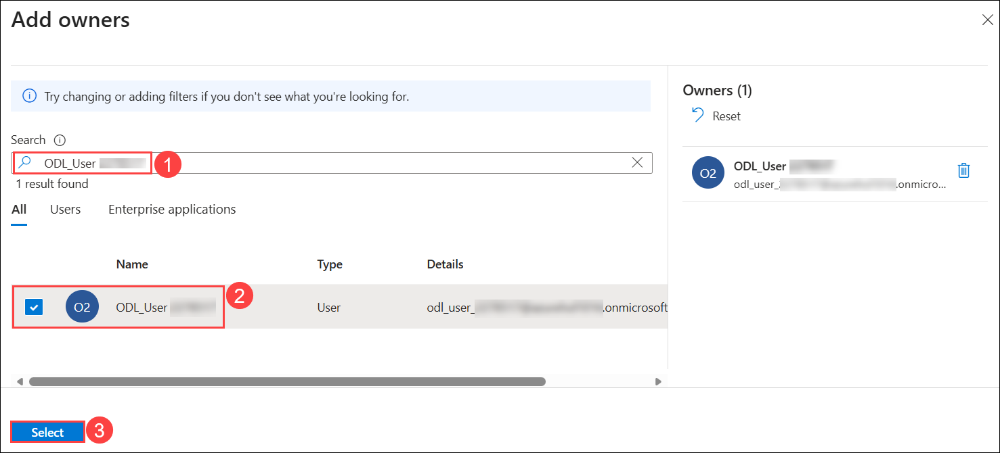

1. Under **Members**, select **No members selected**.

	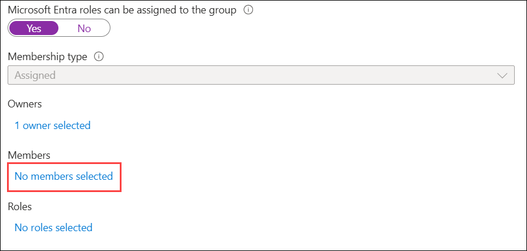

1. On the **Add members** panel, search and select **ODL User <inject key="Deployment ID" enableCopy="false"></inject> (1)** and **Patti Fernandes (2)**. Once selected click **Select (3)** to confirm the members.

	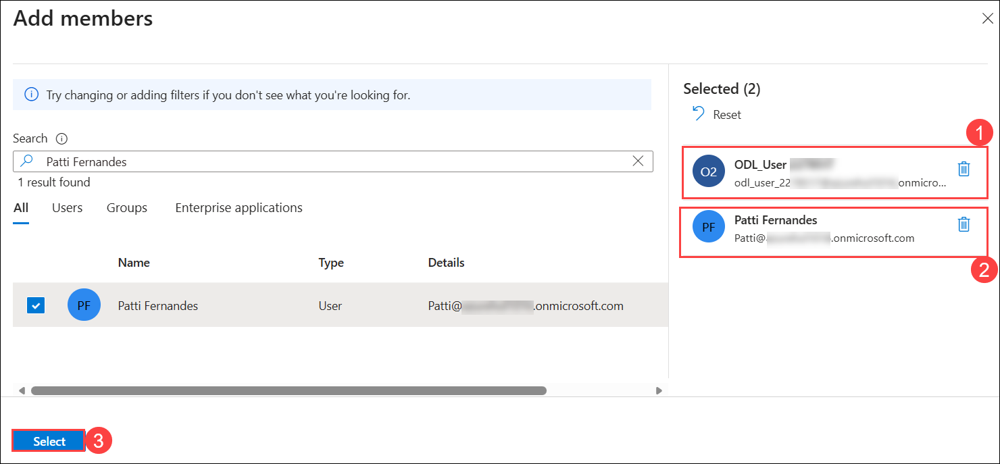

1. Click **No roles selected** **(1)**, search for **Global admin** **(2)**, select the **Global Administrator** role **(3)**, click **Select** **(4)** to assign the role, and then click **Create** **(5)** to create the security group.

	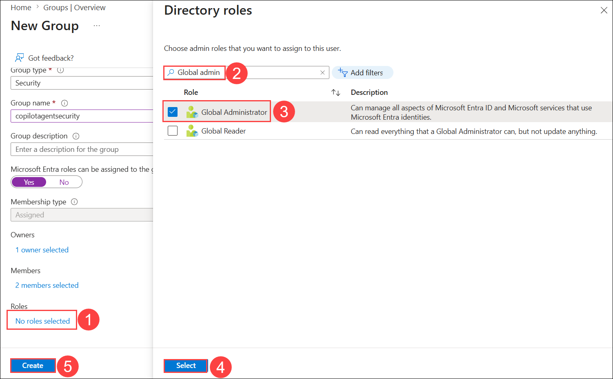

1. In the confirmation dialog, select **Yes**.

	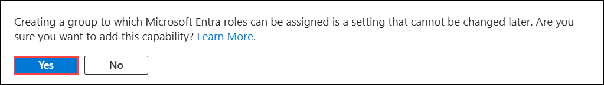

1. Confirm that a success notification appears at the top of the page.

	

### Task 3: Enable Access Management for Azure Resources

1. In the left navigation pane of the Microsoft Entra admin center, expand **Entra ID** and select **Overview**.

	

1. Select the **Properties** tab **(1)**, ensure **Access management for Azure resources** is enabled and set to **Yes** **(2)**, click **Save** **(3)** to apply the changes.

1. Once saved, click **Manage security defaults** **(4)** to configure the tenant's security settings.

	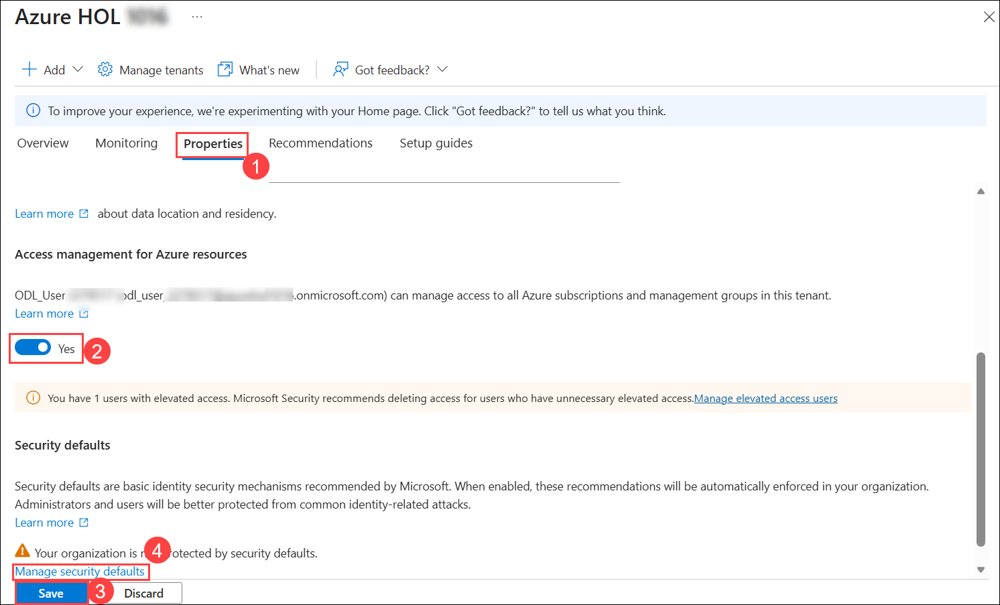

1. On the **Security defaults** panel, under **Security defaults**, select **Enabled (1)** if not already enabled and then click **Save (2)**.

	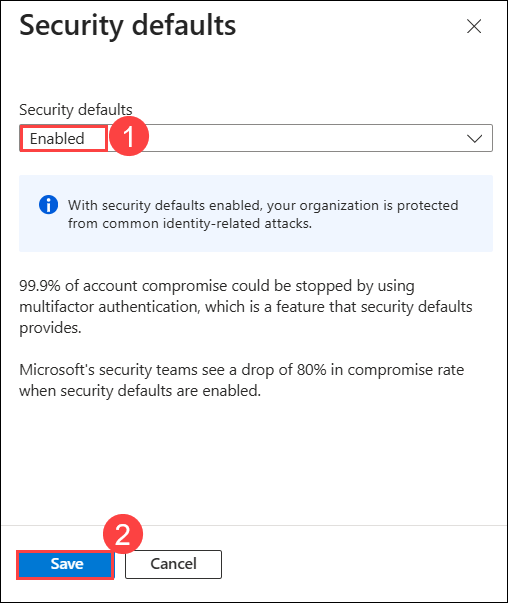

1. Return to the **Properties** page and click **Save** if you have not already saved the changes.

	

### Task 4: Assign the Privileged Role Administrator Role

1. In the left navigation pane of the Microsoft Entra admin center, expand **Entra ID** and select **Roles & admins (1)**, search for **Privileged Role Administrator (2)**, and then select the **Privileged Role Administrator (3)** role from the results.

	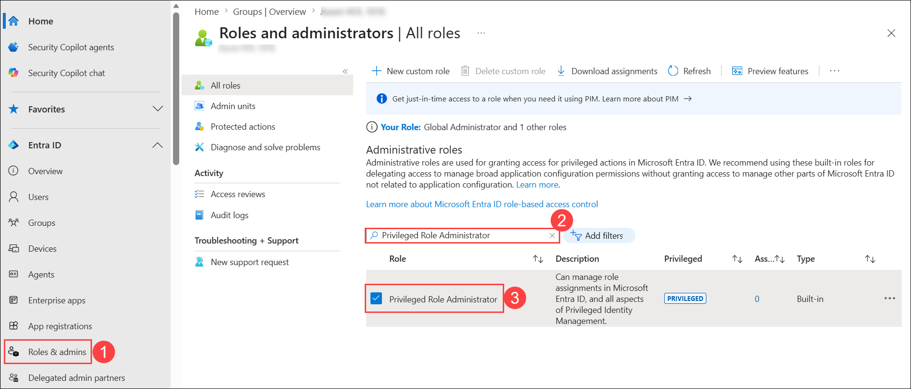

1. On the **Privileged Role Administrator** page, select **+ Add assignments**.

	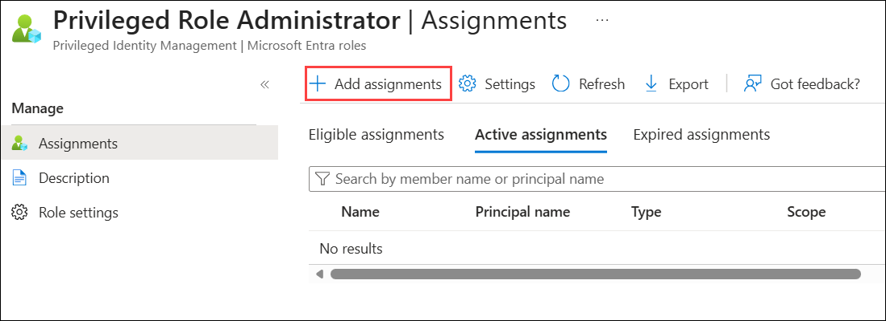

	 >**Note**: Make sure you are on **Active assignments** tab

1. On the **Add assignments** pane, select **copilotagentsecurity (1)** from the list, then click **Add (2)**.

	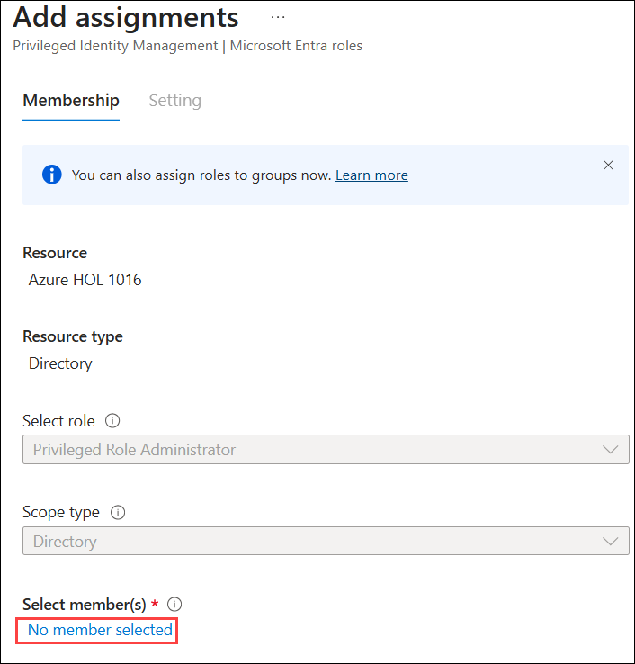

### Task 5: Configure Copilot Studio Authors in Power Platform Admin Center

1. Open a new browser tab and enter the following URL to navigate to the **Power Platform admin center**. 

     ```
	 https://admin.powerplatform.microsoft.com
	 ```

1. Sign in with following  credentials if prompted:

	- **Email/Username:** **<inject key="AzureAdUserEmail"></inject>**

	- **Password:** **<inject key="AzureAdUserPassword"></inject>** 

2. In the left navigation pane, select **Manage (1) > Environments (2)**. Click on **+New (3)**.

	

1. On the New Environment pop-up, provide the name as **DevOne-<inject key="Deployment ID" enableCopy="false"></inject>**.

	

1. Expand **Change default settings (1)**, ensure **Add a Dataverse data store?** is set to **Yes (2)**, and then click **Next (3)**.

	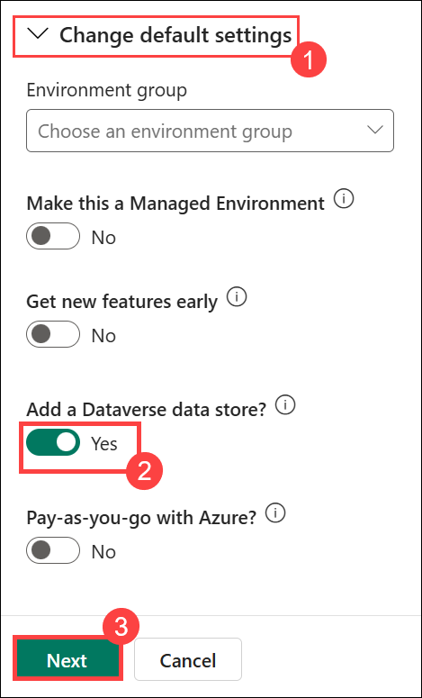

1. On the **Add Dataverse** page, click on **+Select** under Security Group.

	

1. On **Edit Security group** pane search bar, search for **copilotagentsecurity (1)** and select the **copilotagentsecurity (2)** group from the results. Then, select **Done (2)**.

	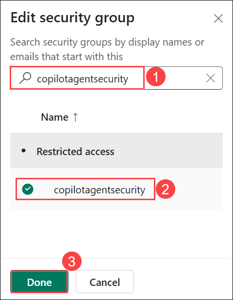

1. Select **Save** to apply the setting.

	

1. Once the newly created environment is ready, click on it to open and then copy the **Environment ID** and paste it in the Notepad for later use.

		

1. In the **Power Platform admin center**, select **Manage (1)** > **Tenant settings (2)**, search for **Copilot Studio authors (3)**, and then select **Copilot Studio authors (4)** from the results.

	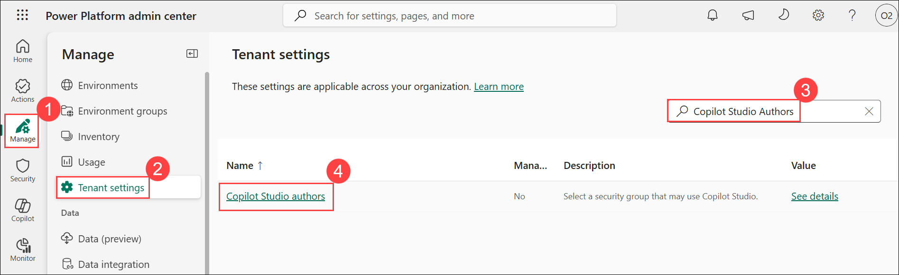

1. On the **Copilot Studio Authors** panel, select the **Edit** icon near security group.

	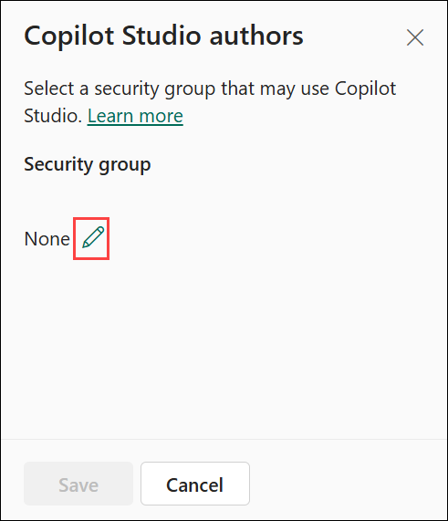

1. On **Edit Security group** pane search bar, search for **copilotagentsecurity (1)** and select the **copilotagentsecurity (2)** group from the results. Then, select **Done (2)**.

	

1. Select **Save** to apply the setting.

	

1. In the navigation pane, select **Licensing (1)**. Select **Billing plans (2)**, click on **New billing plan (3)**. Select **Azure subscription (4)**.

     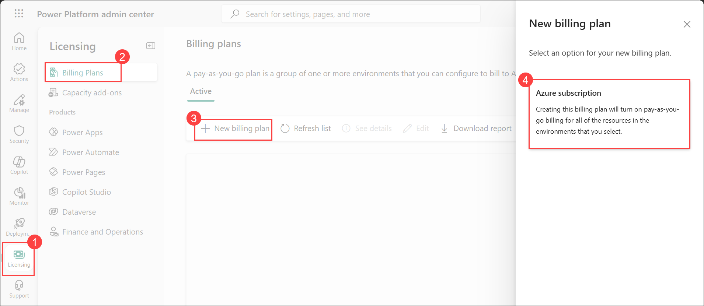

1. Select the below and click on **Next (4)** :
   - In the Name field, provide a name as **zavaplan-<inject key="Deployment ID" enableCopy="false"></inject> (1)** for your new billing plan.
   - From the **Azure subscription (2)** dropdown list, select your **Azure subscription**.
   - From the Resource group dropdown list, select **labvm (3)** resource group.

     	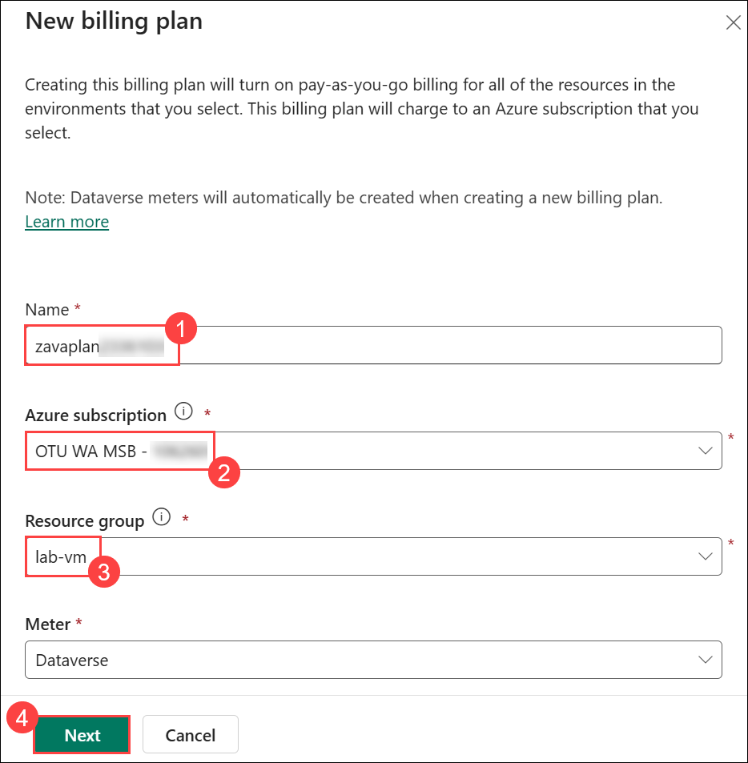

1. Select the following and click on **Save (3)**:

   	- Region: **United States (1)**
   	- Select **DevOne-<inject key="Deployment ID" enableCopy="false"></inject> (2)**

     	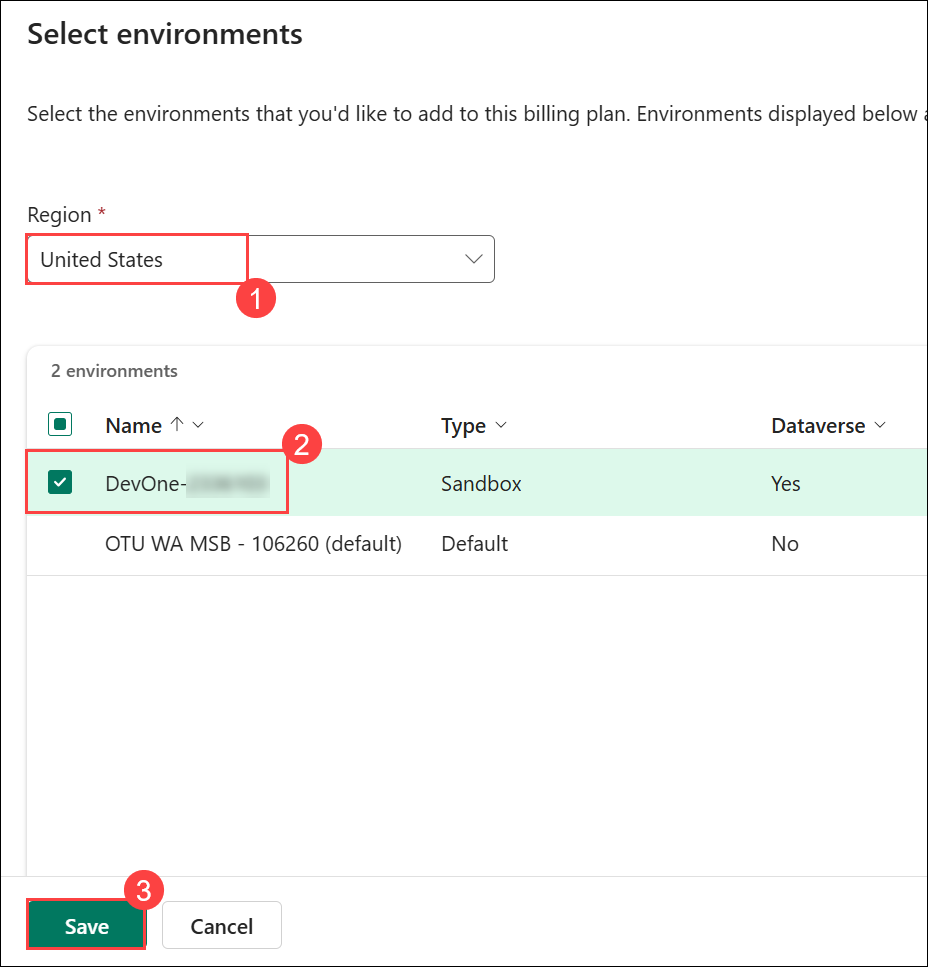

### Task 6: Enable Entra Agent Identity for Copilot Studio

1. In the left navigation pane of **Power Platform admin center**, select **Copilot (1)** > **Settings (2)**, and then select **Entra agent identity for Copilot Studio (3)** to configure agent identity settings.

	 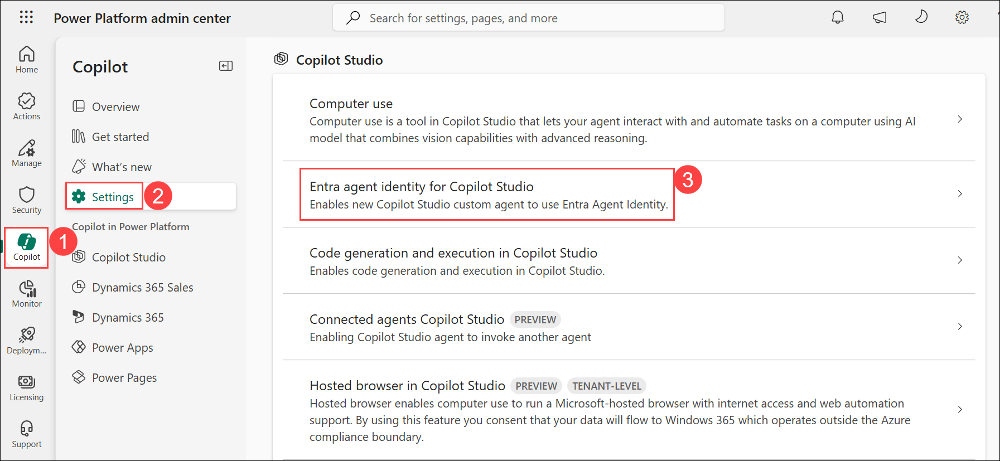

	  >**Note**:If the Entra agent identity for Copilot Studio is not available, please proceed to the next task , its by default enabled for you .

4. On the **Entra Agent Identity for Copilot Studio** panel, select the **DevOne-<inject key="Deployment ID" enableCopy="false"></inject>** environment from the environment list and Select **Edit setting**.

	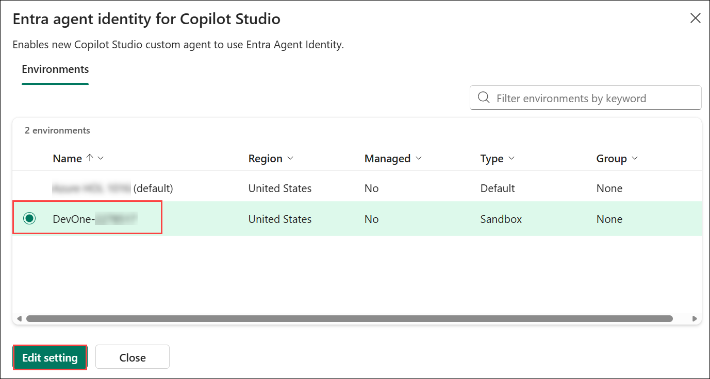

5. On the setting panel of Entra Agent Identity for Copilot Studio, select **On (1)** if not done and click **Save (2)**

	

1. After saving, close the panel.

	

      >**Note:** Enabling Entra Agent Identity allows Copilot Studio agents to be automatically assigned a unique identity in Microsoft Entra ID. This is required for identity governance, Conditional Access, and Defender for Cloud Apps integration in later labs.

### Task 7: Add a SharePoint Connection in the Power Apps Maker Portal

1. Open a new browser tab and enter the following URL to navigate to the **Power Platform** portal. 

     ```
	 https://make.powerapps.com
	 ```

1. Sign in with following  credentials if prompted:

	- **Email/Username:** **<inject key="AzureAdUserEmail"></inject>**

	- **Password:** **<inject key="AzureAdUserPassword"></inject>** 

1. If prompted, on the **Welcome to Power Apps** screen, click **Get started**.

	

1. In the top-right corner, confirm that the **DevOne-<inject key="Deployment ID" enableCopy="false"></inject>** environment is selected in the environment switcher. If not, select the environment switcher and select **DevOne-<inject key="Deployment ID" enableCopy="false"></inject>**.

	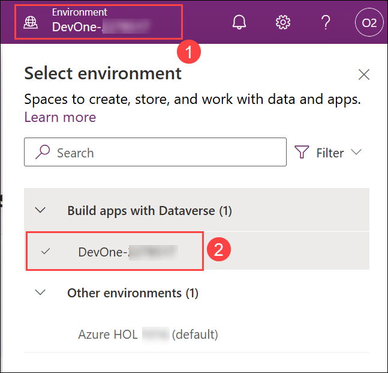

1. In the left navigation bar, expand **... More (1)** and select **Connections (2)**.

	

1. On the **Connections** page, select **+ New connection**.

	

1. In the connector search bar, enter `SharePoint` and  select **SharePoint** from the list of available connectors.

	

1. On the **SharePoint** connection panel, select **Connect directly (cloud services) (1)**, then click **Create**.

	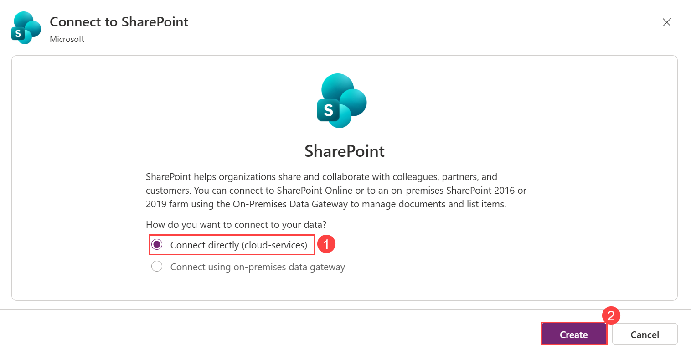

1. When prompted, sign in with **ODL_User** credentials to authorise the connection.
   
	

1. If there is a pop-up for Confirmation pops up, check the box for **I have verified this request and trust this source (1)** and select **Allow access (2)**.

	

1. Confirm that the SharePoint connection appears in the **Connections** list with a status of **Connected**.

	

## Exercise 2: Create the Zava Copilot Studio Agents

In this exercise, you will creates all three Zava agents in Microsoft Copilot Studio. Each agent is configured with a name, description, instructions, and a SharePoint knowledge source. After publishing, each agent is shared with the designated lab user accounts. These agents serve as the live governance targets in Labs 01 through 07.

### Task 1: Create the Zava HR Assistant

1. Open a new tab and enter the following URL to navigate to the **Copilot Studio**. 

     ```
	 https://copilotstudio.microsoft.com
	 ```

1. Sign in with following  credentials if prompted:

	- **Email/Username:** **<inject key="AzureAdUserEmail"></inject>**

	- **Password:** **<inject key="AzureAdUserPassword"></inject>** 

1. If Copilot Studio does not load, replace the `Default-environmentid` **(1)** with the **Environment ID** you just copied and pasted in the Notepad in **Exercise 1 Task 5 Step 9 (2)** and press **Enter**.

	

		

1. On the **Welcome** screen, click on **Get Started**.

	 

1. In the left navigation pane, select **Agents**. On the **Create an agent** page, select **Create blank agent**.

	 

1. Enter **Zava HR Assistant (1)** as the agent name, and then click **Create (2)** to create the agent.

	 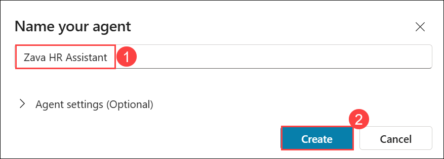

1. Click on **Edit** to enter the Description.

	 

1. In the **Description** field, enter the following description and select **Save**.

    ```
	An AI assistant that helps Zava employees find HR policies, benefits information, and employee procedures.
	```

	 

1. Scroll downn to the **Instructions** field, click on **Edit** to enter the instructions.

	 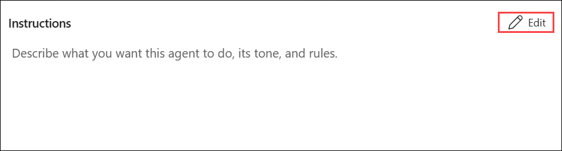

1. Then enter the following instructions **(1)** and click on **Save (2)** to save the changes.

    ```
    You are the Zava HR Assistant. Answer questions using only the information available in the Zava HR SharePoint knowledge base. Do not speculate or provide information outside the knowledge base. Always respond professionally.
    ```

	 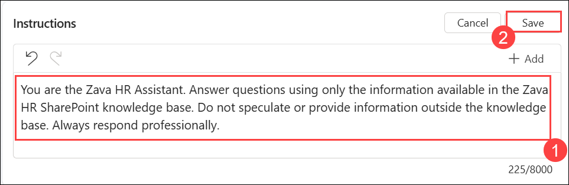	 

1. On the agent configuration page, locate the **Knowledge** section. Select **+ Add knowledge**.

       

1. On the **Add knowledge** panel, select **SharePoint**.

	

1. In the **SharePoint URL** field, enter the SharePoint HR site URL that you copied in in the **Exercise 0 step 13-14** with the following format and select **Add**:

    ```
	https://[TenantPrefix].sharepoint.com/sites/HR<inject key="Deployment ID" enableCopy="false"></inject>
	```

     

1. Select **Add to agent** to connect the SharePoint site as the knowledge source.

      

1. In the top-right corner of the agent configuration page, select **Publish**.

    

1. In the confirmation dialog, select **Publish** to confirm.

	

1. On the agent configuration page, locate the **Channels** tab on the top section (select **+** if it is not directly visible).

	

1. Select **Microsoft 365 and Microsoft Teams** to add them as channels.

	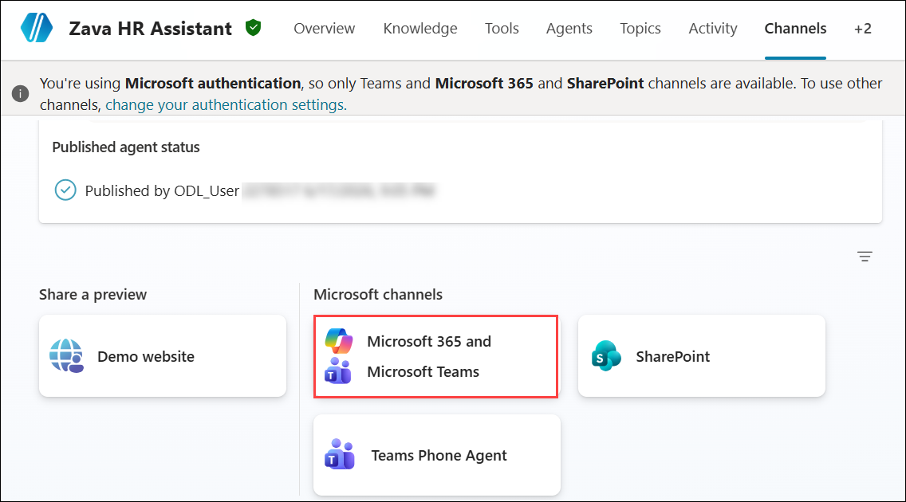

1. Then select **Add channel**.

	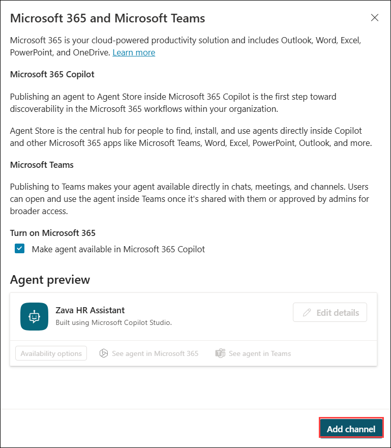

1. Select **Availability options**.

	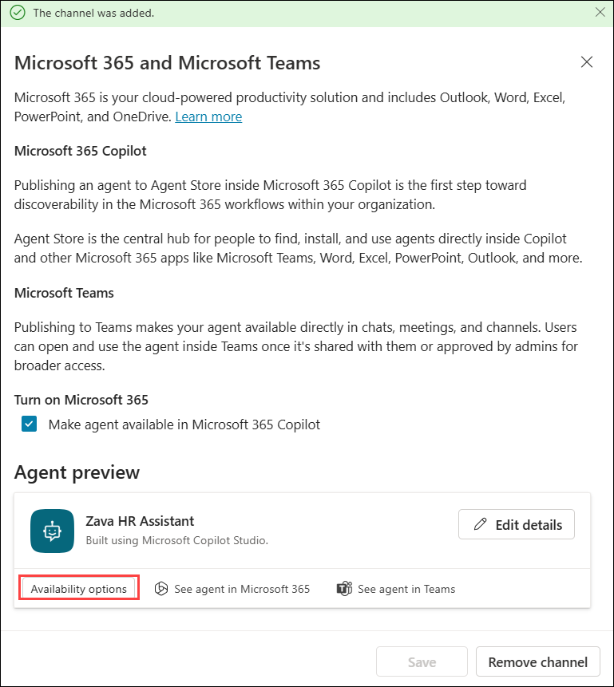

1. On the **Microsoft 365 and Microsoft Teams** page, select **Show to everyone in my org**.

	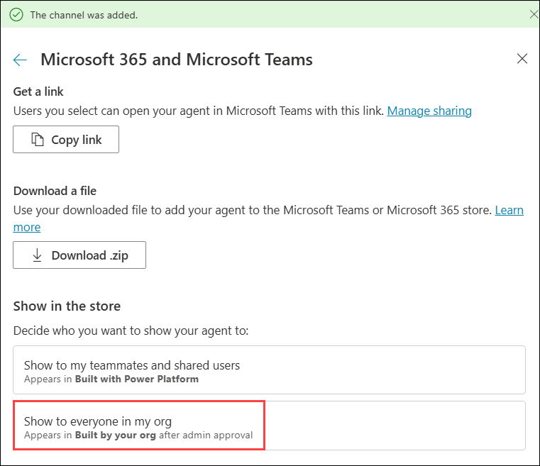

1. Select **Submit to org catalog**.

	

1. On the **Give everyone access to this agent?** confirmation dialog, select **Yes**.

	

1. You will be redirected to **Show in Teams app store for org** and see a notification: **Your agent is submitted and waiting for approval from your Teams admin**. Click on **Close**.

	

### Task 2: Create the Zava Finance Agent

1. In the left navigation pane, select **Agents**. Then select **Create blank agent**.

	

1. Enter **Zava Finance Agent (1)** as the agent name, and then click **Create (2)** to create the agent.

	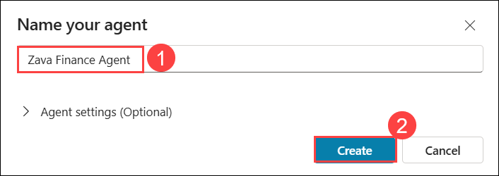

1. Click on **Edit** to enter the Description.

	 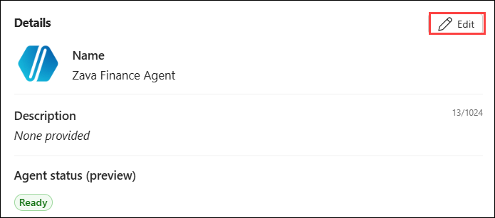
	 
1. In the **Description** field, enter the following **description (1)** and select **Save (2)**.

   ```
   An AI assistant that helps Zava finance team members retrieve budget information, invoice data, and financial reports.
   ```

	 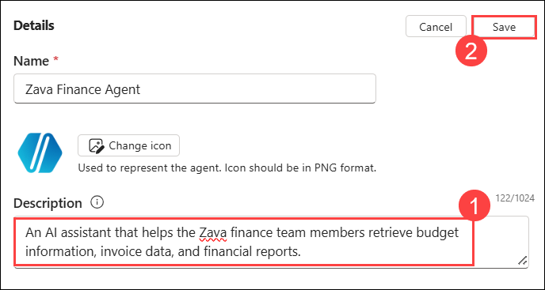

1. Scroll downn to the **Instructions** field, click on **Edit** to enter the instructions.

	 

1. Then enter the following instructions **(1)** and click on **Save (2)** to save the changes.

    ```
    You are the Zava Finance Agent. Answer questions using only the information in the Zava Finance SharePoint knowledge base. Do not share financial data with users who have not been granted access to the Finance SharePoint site. Always respond professionally and flag any requests for data outside your knowledge base.
    ```

	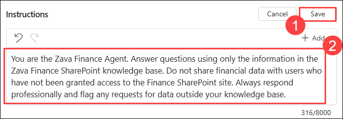

1. Scroll down and on the agent configuration page, locate the **Knowledge** section. Select **+ Add knowledge**.

     

1. On the **Add knowledge** panel, select **SharePoint**.

	

1. In the **SharePoint URL** field, enter the SharePoint Operations site URL that you copied in in the **Exercise 0 step 17-18** with the following format and select **Add**:

    ```
	https://[TenantPrefix].sharepoint.com/sites/Operations<inject key="Deployment ID" enableCopy="false"></inject>
	```

10. Select **Add** to connect the SharePoint site as the knowledge source.

	

11. Then select **Add to agent**.

    

12. On the agent configuration page, locate the **Channels** tab on the top section (select **+** if it is not directly visible).

	

13. Select **Microsoft 365 Copilot and Microsoft Teams** to add them as channels.

	

14. On Microsoft 365 and Microsoft Teams pane, click **Add channel** to add the channel in teams.

	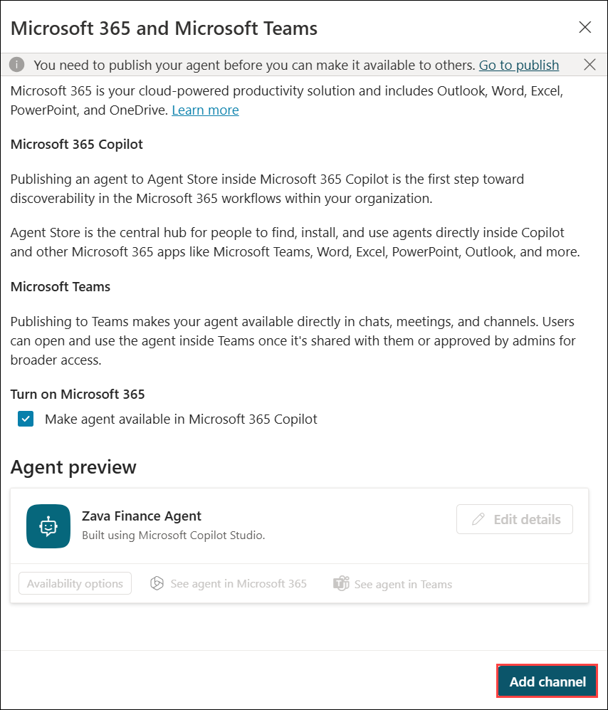

15. In the **Ready to publish?** dialog, select **Publish**. Close the tab once published.

	

1. Select **Availability options**.

	

1. On the **Microsoft 365 and Microsoft Teams** page, select **Show to everyone in my org**.

	

1. Select **Submit to org catalog**.

	

1. On the **Give everyone access to this agent?** confirmation dialog, select **Yes**.

	

1. You will be redirected to **Show in Teams app store for org** and see a notification: **Your agent is submitted and waiting for approval from your Teams admin**. Click on **Close**.

	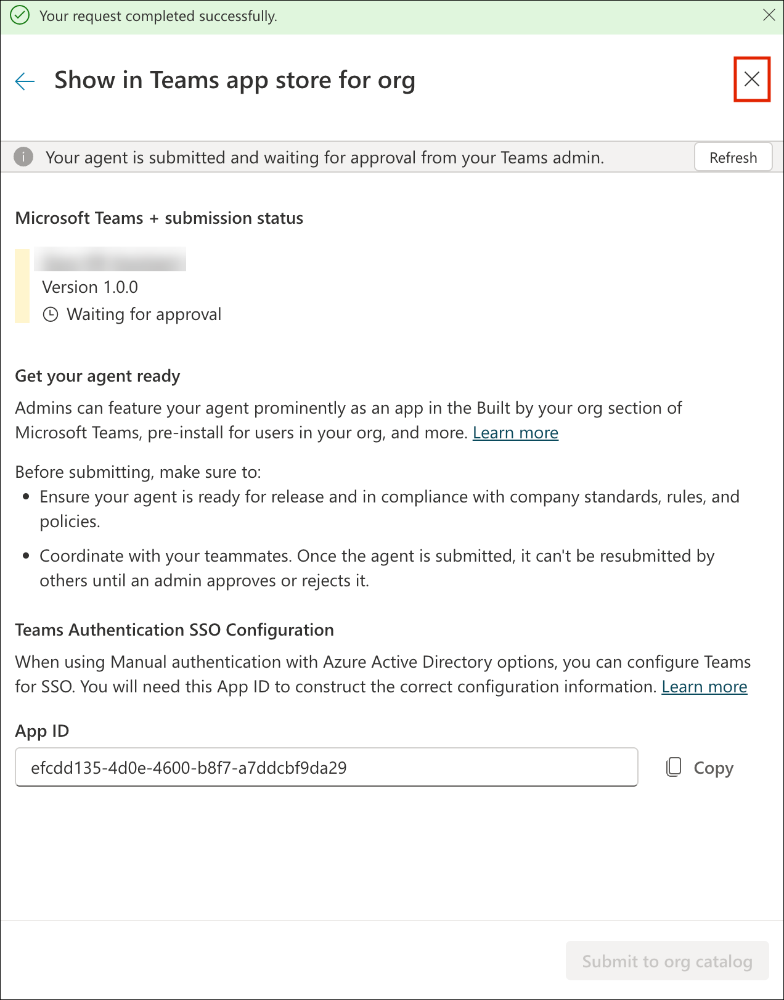

### Task 3: Create the Zava IT Support Agent

1. In the left navigation pane, select **Agents**. Then select **Create blank agent**.

	

1. Enter **Zava IT Support Agent (1)** as the agent name, and then click **Create (2)** to create the agent.

	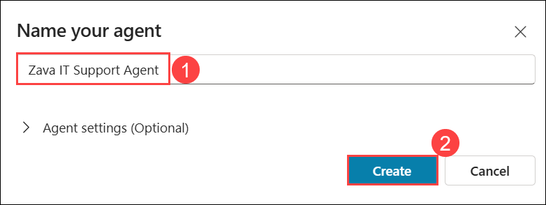

1. Click on **Edit** to enter the Description.

	 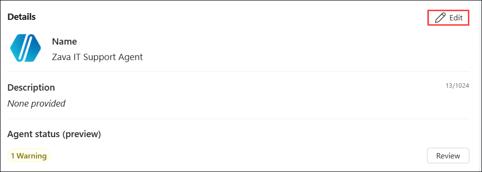
	 
1. In the **Description** field, enter the following **description (1)** and select **Save (2)**.

    ```
	An AI assistant that helps Zava employees resolve common IT issues, submit support requests, and find IT policy documentation.
	```

	 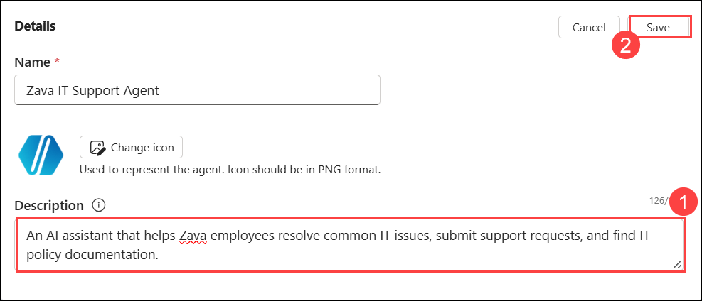

1. Scroll downn to the **Instructions** field, click on **Edit** to enter the instructions.

	 

1. Then enter the following instructions **(1)** and click on **Save (2)** to save the changes.

    ```
    You are the Zava IT Support Agent. Help users with common IT questions using publicly available Microsoft support documentation and Zava IT policies. Do not access or share any sensitive financial or HR information. Escalate complex issues to the IT helpdesk.
    ```

	 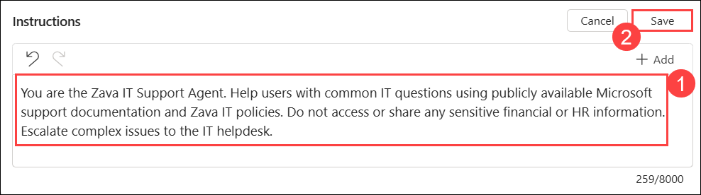

7. On the agent configuration page, locate the **Knowledge** section. Select **+ Add knowledge**.

     

8. On the **Add knowledge** panel, select **Public Websites**.

	

9. In the **URL** field, enter `https://support.microsoft.com/` and select **Add** to connect the site as the knowledge source.

	

10. Then, select **Add to agent**.

	

11. In the top-right corner of the agent configuration page, select **Publish**.

	

12. In the confirmation dialog, select **Publish** to confirm.

	

13. On the agent configuration page, locate the **Channels** tab on the top section (select **+** if it is not directly visible).

	

15. Select **Microsoft 365 and Microsoft Teams** to add them as channels.

	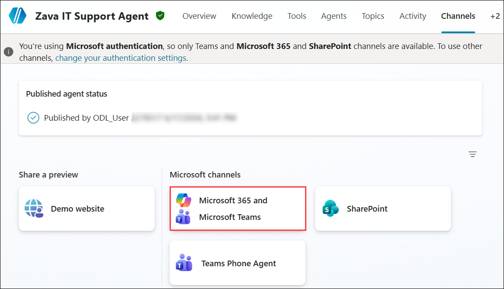

16. Then select **Add channel**.

	

17. Select **Availability options**.

	

18. On the **Microsoft 365 and Microsoft Teams** page, select **Show to everyone in my org**.

	

19. Select **Submit to org catalog**.

	

20. On the **Give everyone access to this agent?** confirmation dialog, select **Yes**.

	

21. You will be redirected to **Show in Teams app store for org** and see a notification: **Your agent is submitted and waiting for approval from your Teams admin**. Close the tab.

## Exercise 3: Upload Zava Knowledge Files to SharePoint

In this exercise, you will uploads the Zava sample business documents to the SharePoint HR and Finance sites. These files contain the sensitive data - including employee PII, payroll records, credit card numbers, and financial forecasts - that will trigger security detections and DLP policy matches throughout Labs 04, 05, and 07.

### Task 1: Upload Files to the Zava HR SharePoint Site

1. Open a new tab and paste the **HR site URL** that you copied in **Exercise 0,Step 13-14** in the following format: 

    ```
	https://[TenantPrefix].sharepoint.com/sites/HR<inject key="Deployment ID" enableCopy="false"></inject>
	```

1. From the left navigation menu, click on **Documents (1)** , select **Create or upload (2)**. Then, select **Files upload (3)**.

	

1. Browse to **C:\LabFiles\lab file\HR (1)**, select all the HR documents and files **(2)**, and then click **Open (3)** to upload them.

	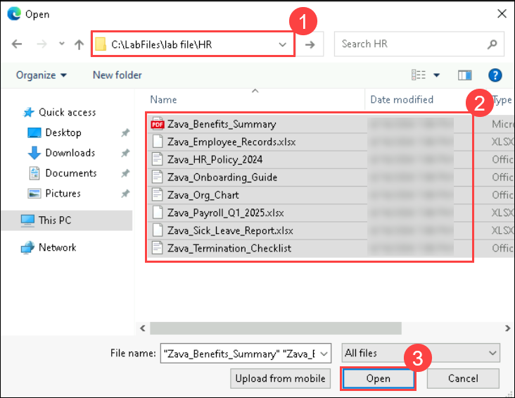

1. Select the following files and then select **Open** to upload them:

   | Filename | Contains |
   |----|----|
   | `Zava_HR_Policy_2024.docx` | Leave and disciplinary policy - no PII |
   | `Zava_Employee_Records.xlsx` | Employee IDs (format: ZVA123456), names, DOB, salary |
   | `Zava_Payroll_Q1_2025.xlsx` | Payroll data with credit card numbers in expense column |
   | `Zava_Onboarding_Guide.docx` | Standard onboarding content |
   | `Zava_Benefits_Summary.pdf` | Insurance and pension details |
   | `Zava_Org_Chart.docx` | Reporting lines and management structure |
   | `Zava_Termination_Checklist.docx` | Departing employee process with names and dates |
   | `Zava_Sick_Leave_Report.xlsx` | Employee names and illness reasons |

1. Wait for all 8 files to finish uploading.

1. On the **Documents** page, confirm that all 8 files appear in the document library.

	

### Task 2: Upload Files to the Zava Finance SharePoint Site

1. Open a new tab and paste the **Operations site URL** that you copied in **Exercise 0,Step 17-18** in the following format: 

   ```
   https://[TenantPrefix].sharepoint.com/sites/Operations<inject key="Deployment ID"  enableCopy="false"></inject>
   ```

1. From the left navigation menu, click on **Documents (1)** , select **Create or upload (2)**. Then, select **Files upload (3)**.
   
	

1. Browse to **C:\LabFiles\lab file\Operations (1)**, select all the Operations documents and files **(2)**, and then click **Open (3)** to upload them.

	  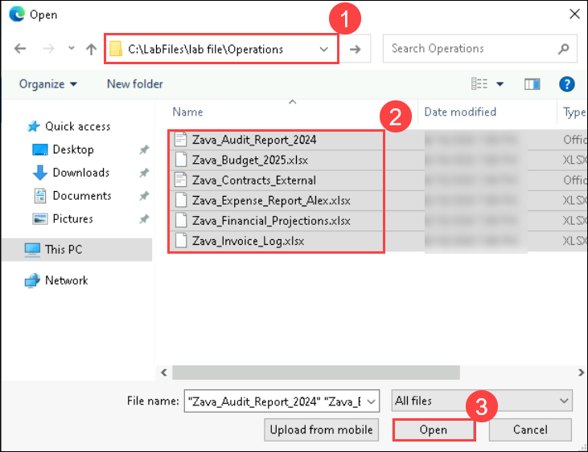

1. Select the following files and then select **Open** to upload them:

    | Filename | Contains |
    |----|----|
    | `Zava_Budget_2025.xlsx` | Department budgets and cost centres |
    | `Zava_Invoice_Log.xlsx` | Vendor invoices with IBAN and account numbers |
    | `Zava_Expense_Report_Alex.xlsx` | Alex Wilber's expenses with Visa credit card number |
    | `Zava_Audit_Report_2024.docx` | Internal audit findings - marked Confidential |
    | `Zava_Contracts_External.docx` | Third-party vendor contract - externally shared |
    | `Zava_Financial_Projections.xlsx` | Revenue forecasts with broad SharePoint permissions |

1. Wait for all 6 files to finish uploading.

1. On the **Documents** page, confirm that all 6 files appear in the document library.

    


### Task 3: Verify Agents in the Microsoft Agent 365 Agent Registry

1. Open a new browser tab and navigate to . Sign in with **ODL_User** credentials if prompted.

    ```
	https://admin.cloud.microsoft/
	```

	- **Email/Username:** <inject key="AzureAdUserEmail"></inject>

	- **Password:** <inject key="AzureAdUserPassword"></inject>

1. Select **Agents (1)** > **All agents (2)**, and verify that the following agents **(3)** appear in the registry with an **Available** status.

   | Agent Name | Status |
   |----|----|
   | Zava HR Assistant | Available | 
   | Zava Finance Agent | Available | 
   | Zava IT Support Agent | Available |

	  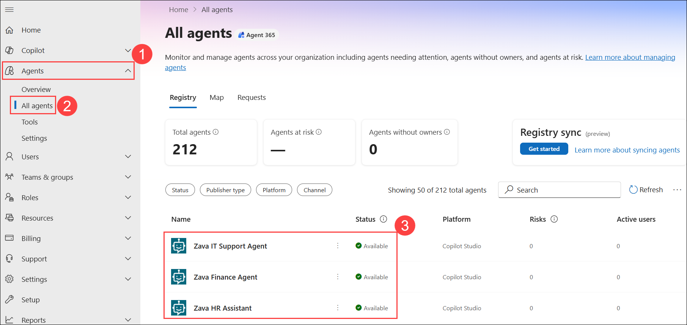

	  >**Note:** It may take up to 10 minutes after publishing in Copilot Studio for agents to appear in the Agent Registry. If the agents are not visible, wait 10 minutes and then refresh the page.


## Exercise 4: Enable Organizational Setup

1. Navigate to **Exchange Admin Center** using the below URL

    ```
    https://admin.cloud.microsoft/exchange
	```
1. Sign in with **ODL_User** credentials if prompted.

	  - **Email/Username:** <inject key="AzureAdUserEmail"></inject>
	  - **Password:** <inject key="AzureAdUserPassword"></inject>
	
1. Select the **Cloud Shell (1)** icon from the top menu, and then choose **PowerShell (2)** as the Cloud Shell environment.

	  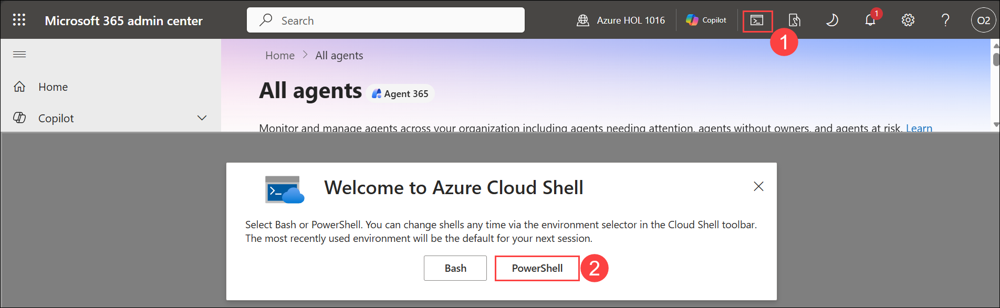

1. In the **Getting started** pane, select **No storage account required (1)**, select **your subscription (2)**, and then select **Apply (3)**.

	  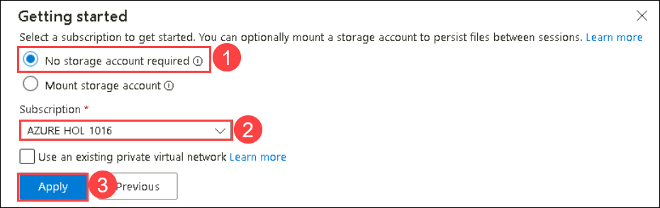

1. After the Cloud Shell session is ready and displays the PowerShell prompt, run the following command to disconnect the current Exchange Online session

    ```
    Disconnect-ExchangeOnline -Confirm:$false	
	```

	  

1. Connect to Exchange Online Using Device Authentication
by running the following command to initiate a new Exchange Online connection using device authentication:

    ```
    Connect-ExchangeOnline -Device
    ```

	  

    - Note: A device code and sign-in URL will be displayed. Open the URL and paste the code to complete the authentication

	     

		 

1. After the Exchange Online PowerShell session is successfully connected, run the following command to prepare the Exchange Online organization for advanced configuration tasks:

    ```
    Enable-OrganizationCustomization
	```

	  

      > **Note**: This may take upto 24 hours to get organization custimaztion enabled.

      > **Note:** If the message **"This operation is not required. Organization is already enabled for customization."** appears, no further action is needed and you can proceed to the next lab.

	  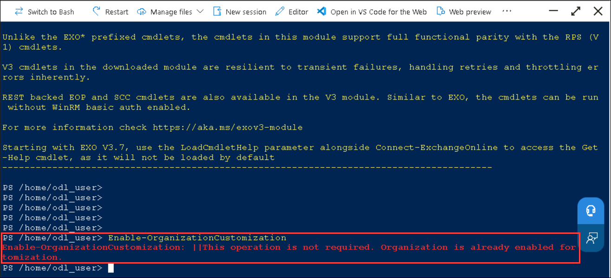	 

## Summary

In this lab, you completed the full environment baseline for the Zava Corporation AI security course. You created a role-assignable security group in the Microsoft Entra admin center, configured ODL User as owner and member, assigned the Privileged Role Administrator role, and enabled the group as the authorised Copilot Studio Authors group in Power Platform Admin Center. You enabled Entra Agent Identity for Copilot Studio at the environment level, added a SharePoint connection in the Power Apps maker portal, and created three Copilot Studio agents - Zava HR Assistant, Zava Finance Agent, and Zava IT Support Agent - each connected to a designated knowledge source, published across Teams and Microsoft 365 channels. You uploaded 14 sample business documents containing realistic sensitive data across the Zava HR and Finance SharePoint sites, and verified that all three agents are registered and Active in the Microsoft Agent 365 Agent Registry. The environment is now fully prepared for security configuration in Labs 01 through 07.
