# Lab 03: Conditional Access for Zava Agent Identities

### Estimated time: 30 Minutes

## Introduction

Zava's CISO has mandated that only reviewed and approved AI agents may access company resources. Any agent that has not been through the governance review process must be blocked automatically. Additionally, if any agent identity shows signs of compromise - such as anomalous token acquisition behaviour - it must be blocked immediately without manual intervention.

You will implement both controls using Conditional Access for Agent Identities (Preview). Patti Fernandes will validate that policy evaluation is visible in sign-in logs. This lab establishes the Zava agent governance baseline that all subsequent security labs build upon.

Conditional Access for Agent Identities is a preview capability in Microsoft Entra ID that extends Zero Trust controls to AI agents. you will create custom security attributes to classify the approval status of each Zava agent, build a Conditional Access policy that blocks all unapproved agent identities from accessing organisational resources, and create a second policy that blocks any agent identity exhibiting high-risk behaviour based on Entra ID Protection signals. The policies will first be validated in Report-only mode before being switched to enforcement. Patti Fernandes will investigate agent sign-in events to confirm Conditional Access policy evaluation.

## Objectives

- Create a custom security attribute set and approval status attribute for agent classification.
- Assign approval status attributes to all three Zava agent identities.
- Create a Conditional Access policy that blocks all unapproved agent identities.
- Validate the policy scope using the What If tool to confirm an untagged agent would be blocked.
- Switch the policy to enforcement mode.
- Create a second Conditional Access policy that blocks high-risk agent identities.
- Generate agent sign-in events by invoking the Zava HR Assistant as Patti Fernandes.
- Investigate Conditional Access policy evaluation in agent identity sign-in logs.

## Exercise 1: Create Custom Security Attributes for Agent Governance

### Task 1: Assign the Attribute Definition Administrator Role

1. Open a browser and navigate to **Microsoft Entra admin center** using the below URL. Sign in with **ODL User** credentials if prompted. 

    ```
    https://entra.microsoft.com
	```

1. In the left navigation pane, in **Roles & admins (1)** under **Entra ID**, and ensure **All roles (2)** is selected. Search for **Attribute Definition Administrator (3)** and select the **Attribute Definition Administrator (4)** role from the results.

	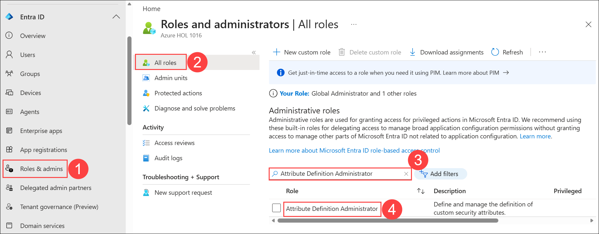

1. On the **Attribute Definition Administrator | Assignments** page, select **+ Add assignments**.
	
	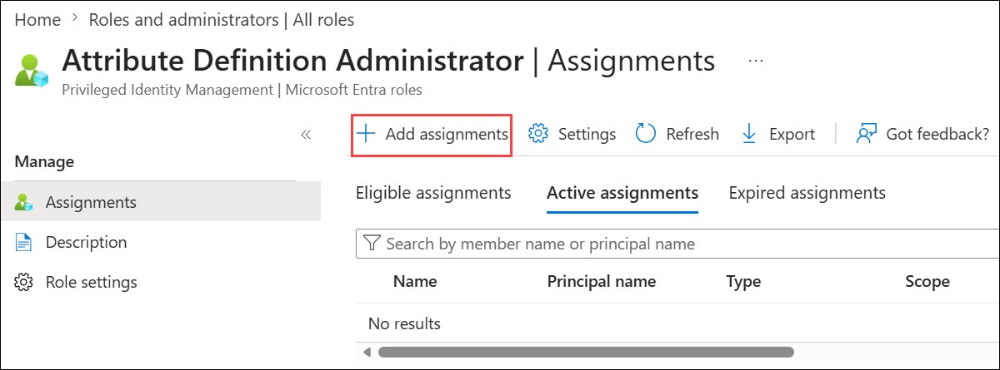

1. Under **Select member(s)**, select **No member selected** to choose the user or group to assign to the **Attribute Definition Administrator** role.

	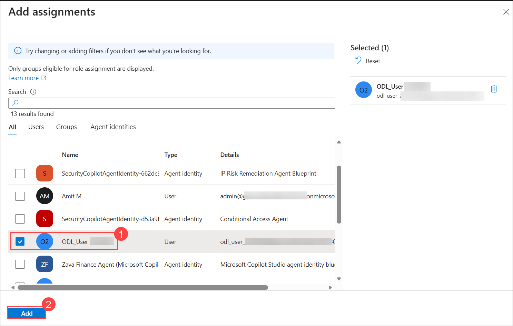

1. In the **Select a member** pane, search for your **ODL_User<inject key="Deployment ID" enableCopy="false"></inject> (1)**, select the **user (2)** from the results, and then select **Select (3)**.

	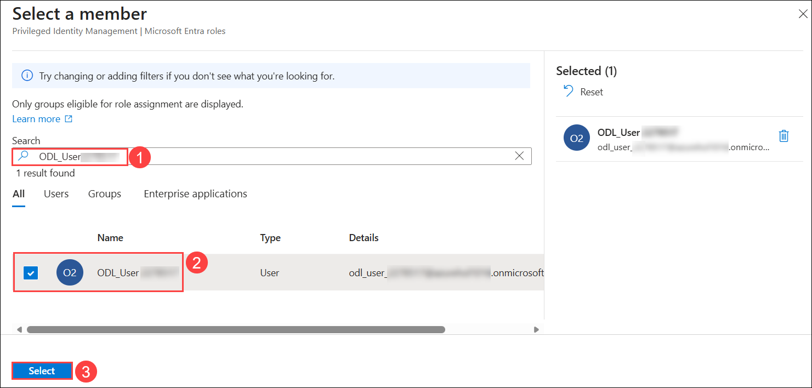

1. Verify that your lab user account appears under **Selected member(s)**, and then select **Next**.

	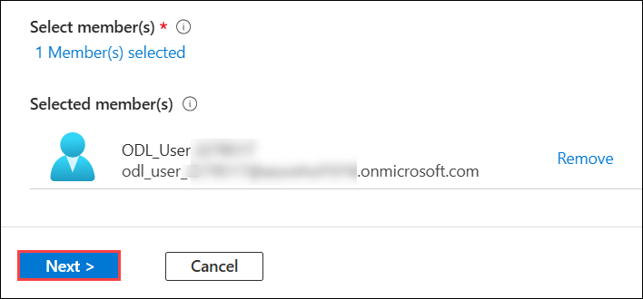

1. Select the assignemnt type as **Active (1)** , make sure **Permanently assigned** is enabled and enter **Active (2)** in the Justification field. Then click on **Assign (3)**.

	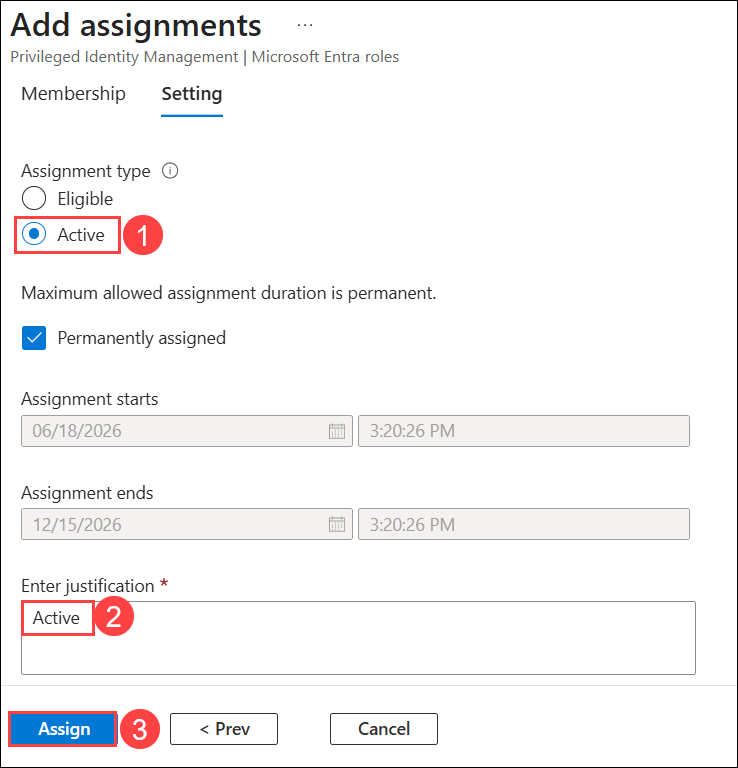

1. Verify that your lab user account appears under the **Active assignments** tab for the **Attribute Definition Administrator** role before proceeding to the next task.

	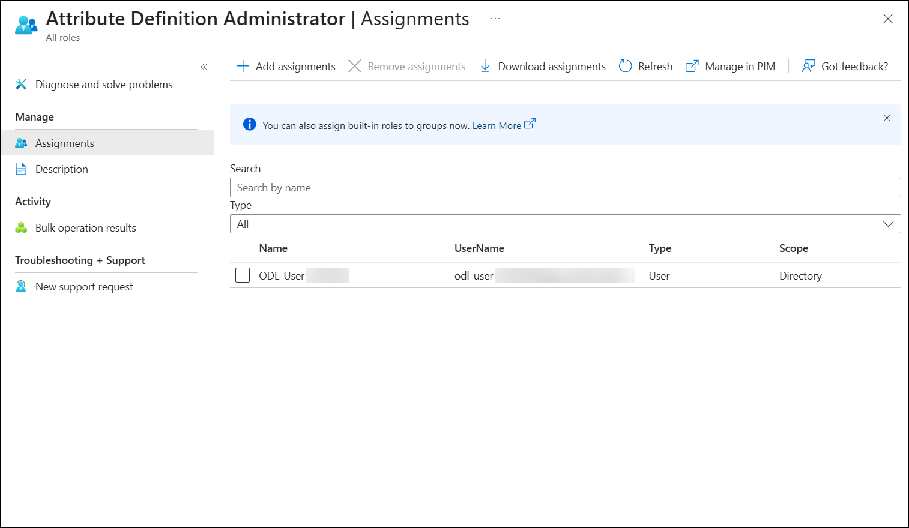

### Task 2: Create the AgentAttributes Attribute Set

1. Expand **Entra ID (1)** in navigation pane, select **Custom security attributes (2)**, and then select **+ Add attribute set (3)**.

	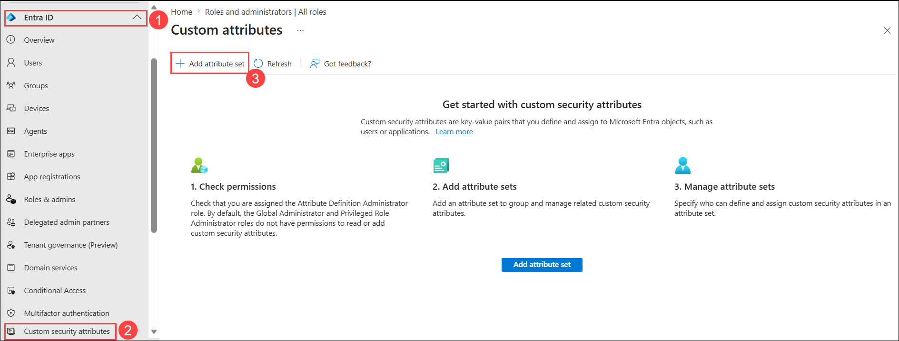

1. On the **Add attribute set** panel, add the following and click on **Add** **(3)**:

   - In the **Attribute set name** field, enter `AgentAttributes` **(1)**.

   - In the **Description** field, enter `Attribute set for classifying AI agent approval and governance status` **(2)**.

   - In the **Maximum number of attributes** field, leave the default value.

	 

1. Verify that the **AgentAttributes** attribute set appears in the **Custom attributes** list before proceeding to the next task.

	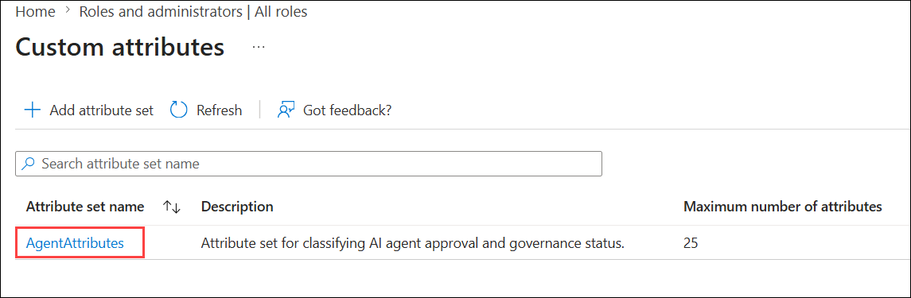

### Task 3: Create the AgentApprovalStatus Attribute

1. On the **Custom security attributes** page, select **AgentAttributes** to open the attribute set.

	

1. On the **AgentAttributes | Active attributes** page, select **+ Add attribute** to create a new custom security attribute.

	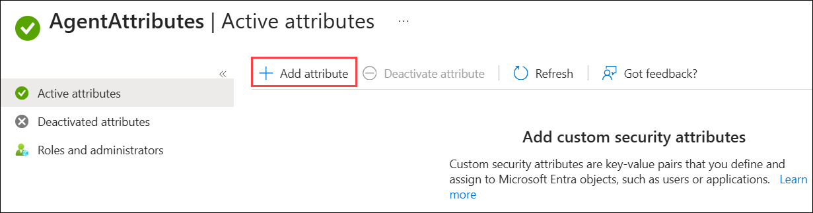

1. In the **New attribute** pane, configure the attribute with the following settings:

    - **Attribute name:** `AgentApprovalStatus` **(1)**

    - **Description:** `Tracks the approval status of each AI agent identity in the Zava governance review process.` **(2)**

    - **Data type:** `String` **(3)**

    - **Allow multiple values to be assigned:** `Yes` **(4)**

    - **Only allow predefined values to be assigned:** `Yes` **(5)**

	- **Predefined values**: Select **+ Add value (6)** to define the allowed approval status values

		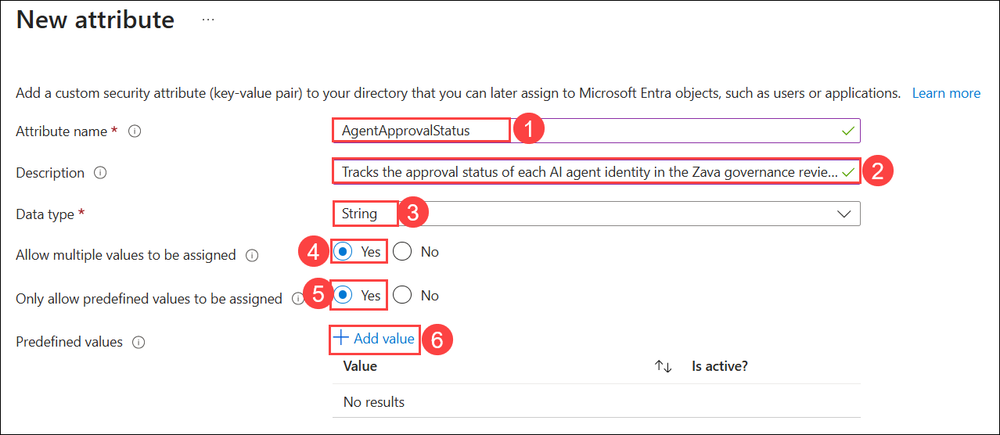

1. In the **Add predefined value** pane, enter **New (1)** as the value, ensure **Is active?** remains selected, and then select **Add (2)**.

	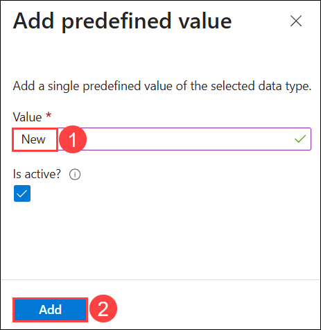		

1. Select **+ Add value**.

	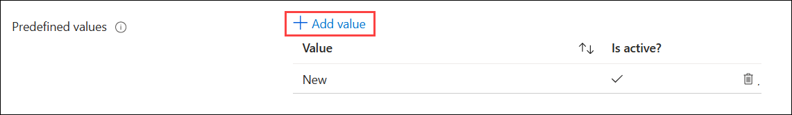

1. Similarly, add the following **predefined values**:

    - `In_Review`
	- `HR_Approved`
	- `Finance_Approved`
	- `IT_Approved`
	  
1. Verify that all predefined values (**New**, **In_Review**, **HR_Approved**, **Finance_Approved**, and **IT_Approved**) **(1)** are listed and active, and then select **Save (2)**.

	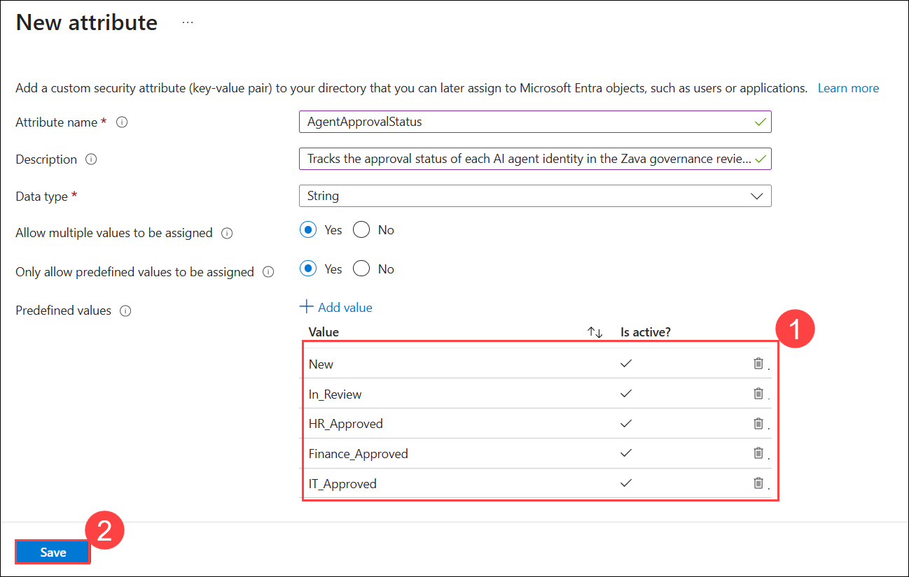

15. Confirm that **AgentApprovalStatus** appears in the attributes list under **AgentAttributes**.

	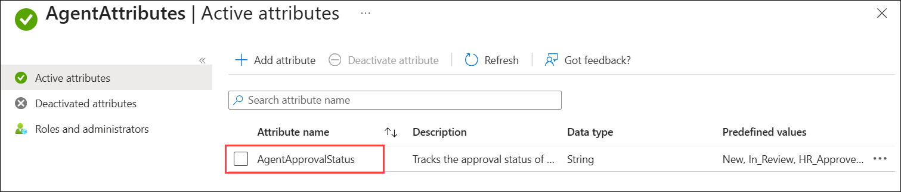

### Task 4: Assign HR_Approved to the Zava HR Assistant

1. In **Microsoft Entra ID**, from the left navigation pane select **Agents (1)** under **Entra ID**, choose **Agent identities (2)**, and select the **Zava HR Assistant (Microsoft Copilot Studio) (3)** agent identity.

	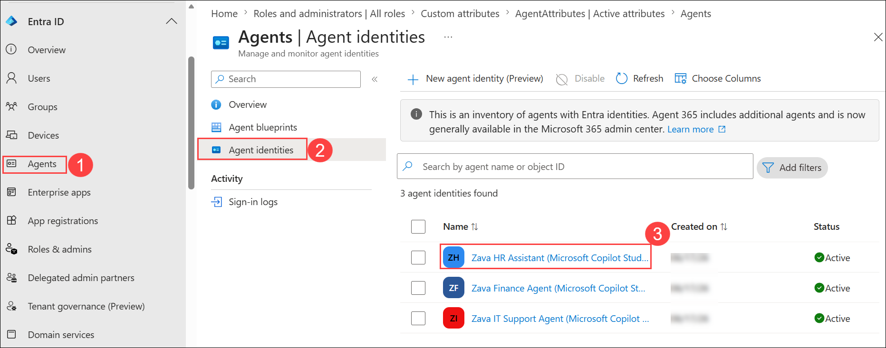

3. On the **Overview** page, in the left sub-navigation, select **Custom security attributes**.

	

4. On the **Custom security attributes** page, select **+ Add assignment**.

	

5. On the **Add custom security attribute assignment** panel, configure the following:

   - **Attribute set:** Select **AgentAttributes**.
   - **Attribute name:** Select **AgentApprovalStatus**.
   - **Assigned values:** Select **Add value** > **HR_Approved** from the drop-down and click **Save**.

		

		

6. Select **Save** to apply the assignment.

	

7. Confirm that **AgentApprovalStatus** appears with the value **HR_Approved** on the custom security attributes page.

8. Similarly assign the following attributes to respective agents.

   - **Zava Finance Agent (Microsoft Copilot Studio)**: New
   - **Zava IT Support Agent (Microsoft Copilot Studio)**: New


## Exercise 2: Create a Conditional Access Policy to Block Unapproved Agent Identities

### Task 1: Create the Policy and Configure Assignments

1. In the left navigation pane of the Microsoft Entra admin center, expand **Entra ID**, select **Conditional Access (1)**, choose **Policies (2)**, and then select **+ New policy (3)**.

	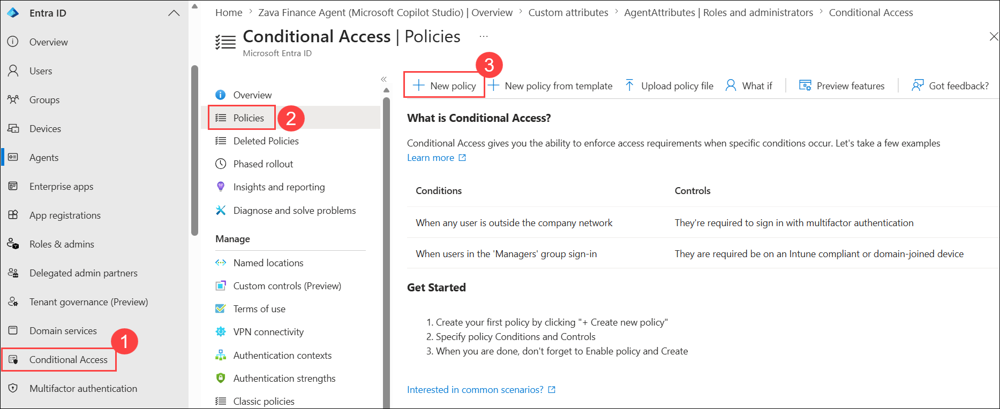

1. In the **New Conditional Access policy** pane, enter **Zava - Block Unapproved Agent Identities (1)** as the policy name.

1. Under **Assignments**, select **0 users or agents (Preview) selected (2)** under **Users or agents**. 

1. On the assignments panel, set **What does this policy apply to?** to **Agents (3)**, and under **Include (4)**, select **All agent identities (5)**.

	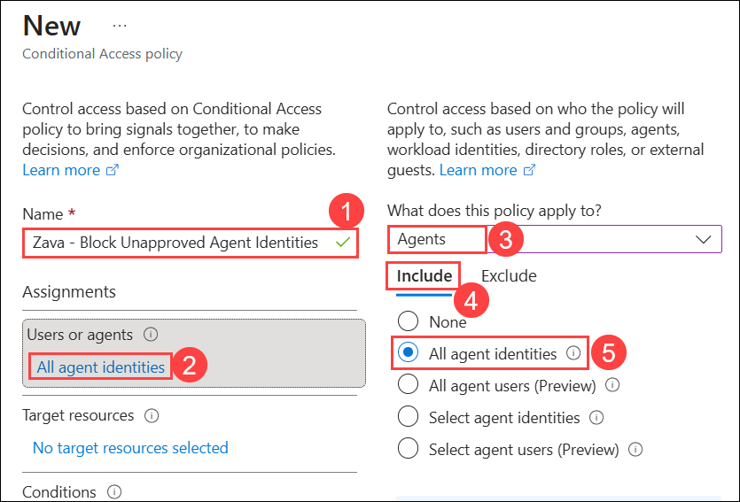

1. Under **Exclude (1)**, select **Select agent identities (2)** to specify the agent identities that should be excluded from this policy, then click on **None (1)** under **Select based on attributes (3)**.


	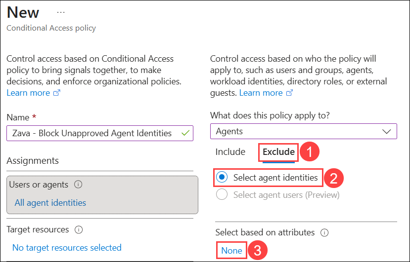

1. In the **Edit filter** pane, set the **Configure** to **Yes (1)**, select **AgentApprovalStatus (1)**, set the operator to **Contains (2)**, enter **HR_Approved (3)** as the value, and then select **Done (3)** to confirm the exclusion configuration.

	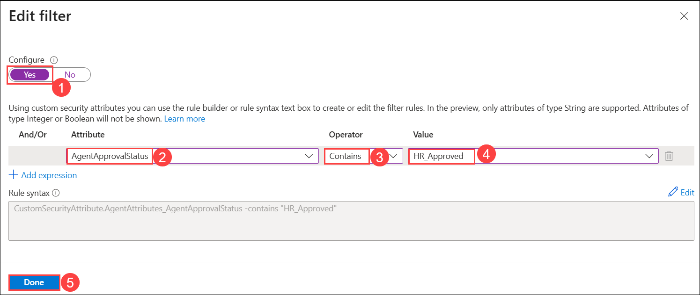

1. Under **Exclude**, click on **None** under **Select individual agent identities**.

	

1. Select **Zava HR Assistant (1)** and click on **Select (2)** 

	

1. Under **Target resources**, select **No target resources selected**.

	

1. Under **Include**, select **All resources (formerly 'All cloud apps')**.

	

1. Under **Access controls**, on the **Grant** panel, confirm that **Block access** is selected.

1. For **Enable policy**, keep **Report-only** and click **Create** to save the policy.

	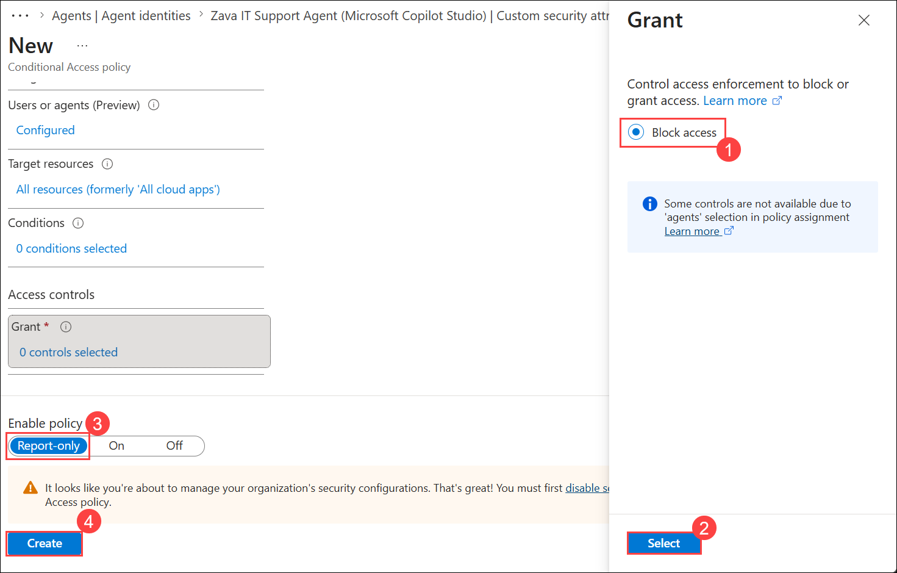

### Task 2: Validate the Policy Using the What If Tool

1. On the policy page, select **What If** to open the Report-only impact view.

   > **Note:** The What If tool allows you to simulate whether a specific identity would be affected by this policy without enforcing it.

	

2. On the **What If** panel, under **Select identity type**, select **Agent identities (Preview)**.

	

2. Select **Edit agent identity**.

	

3. In the agent identity search field, search for and select **Zava Finance Agent (Microsoft Copilot Studio)**.

	

4. Under **Target resource**, set **Select target type** to **Cloud apps**. Select **+ Select cloud app**.

	

5. In the search field, enter `Office 365 SharePoint Online`. Select **Office 365 SharePoint Online** from the results. Choose **Select** to confirm.

	

6. Select **What if** to run the simulation.

	

7. Review the results and confirm that the policy **Zava - Block Unapproved Agent Identities** shows as **Applied** - because the Zava Finance Agent is NOT excluded by the `HR_Approved` attribute.

	

8. Return to the **Edit agent identity** link and change the agent to **Zava HR Assistant**.

	

	

8. Select **What if** to run the simulation.

	

9. Review the results and confirm that the policy **Zava - Block Unapproved Agent Identities** shows as **Not applied** - because the Zava HR Assistant is excluded by the `HR_Approved` attribute.

	

10. Select **Close** to exit the What If panel.

### Task 3: Switch the Policy to Enforcement Mode 

1. Navigate back to **Policies** and click on **Zava - Block Unapproved Agent Identities**

	

2. Under **Enable policy**, select **On**.

3. Select **Save** to apply the change.

4. On the **Policies** page, confirm that **Zava - Block Unapproved Agent Identities** shows a status of **On**.

	

	 >**Note:** If you receive the error “Security defaults must be disabled to enable Conditional Access policy”, click on Disable security defaults and turn off the Security Defaults option. Once disabled, proceed with enabling the Conditional Access policy.

	  


## Exercise 3: Create a Conditional Access Policy to Block High-Risk Agent Identities

### Task 1: Create the Policy and Configure Assignments

1. On the **Conditional Access** page, select **+ New policy**.

	

2. In the **Name** field, enter `Zava - Block High Risk Agent Identities`.

3. Under **Assignments**, select **0 users or agents (Preview) selected** under **Users or agents**.

	

4. Under **What does this policy apply to?**, select **Agents**.

5. Under **Include**, select **All agent identities (Preview)**.

	

6. Under **Target resources**, select **No target resources selected**, then select **All resources (formerly 'All cloud apps')**.

	

7. Under **Conditions**, select **0 Conditions selected**. Then select **Not Configured** under **Agent Risk**.

	

8. On the **Agent risk** panel, set **Configure** to **Yes**. Under **Configure agent risk levels needed for policy to be enforced**, select **High**. Select **Done** to confirm the condition.

	

9. Under **Access controls**, under **Grant**, make sure that **Block access** is selected.

	

10. Under **Enable policy**, select **Report-only**.

    > **Note:** This policy is set to Report-only because agent risk signals from Entra ID Protection require active agent usage over time before risk levels are generated. In a newly provisioned lab environment, no risk signals will be present yet. Report-only mode allows the policy to be evaluated against future sign-in events without blocking access prematurely. In a production environment, this policy would be switched to On once baseline risk signal data is established.

11. Select **Create** to save the policy.

	

12. On the **Policies** page, confirm that **Zava - Block High Risk Agent Identities** appears with a status of **Report-only**.


## Exercise 4: Generate Agent Sign-In Events and Investigate Conditional Access Policy Evaluation

### Task 1: Invoke the Zava HR Assistant

1. Open a new **InPrivate** or **Incognito** browser window. Navigate to Copilot studio and Click on **Sign in**.

    ```
    https://copilot.microsoft.com
    ```

   

1. Click on **Continue with Microsoft.**

   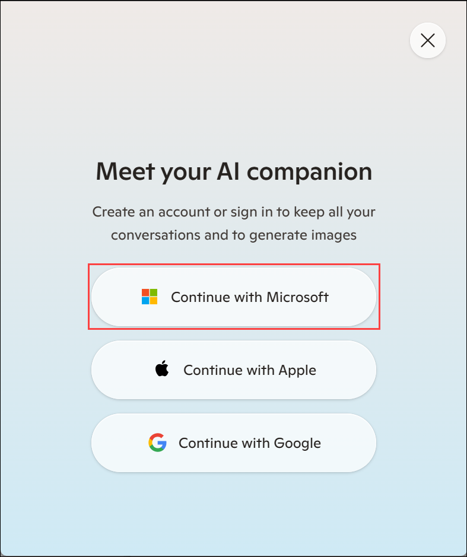

1. Sign in with **Patti Fernandes** credentials from the **Resources** tab. (You can use **<inject key="User 01 UPN"></inject>** as your ID and Use the User's Password from the Resources tab.)

1. Click on the **Work** Tab on the **Which Copilot experience are you looking for?**.

	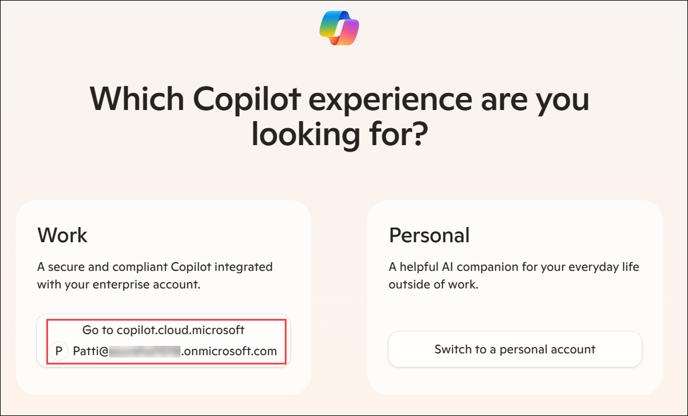

1. In the Microsoft 365 Copilot chat interface, select **All agents** from the navigation. Search for and select **Zava HR Assistant**.

	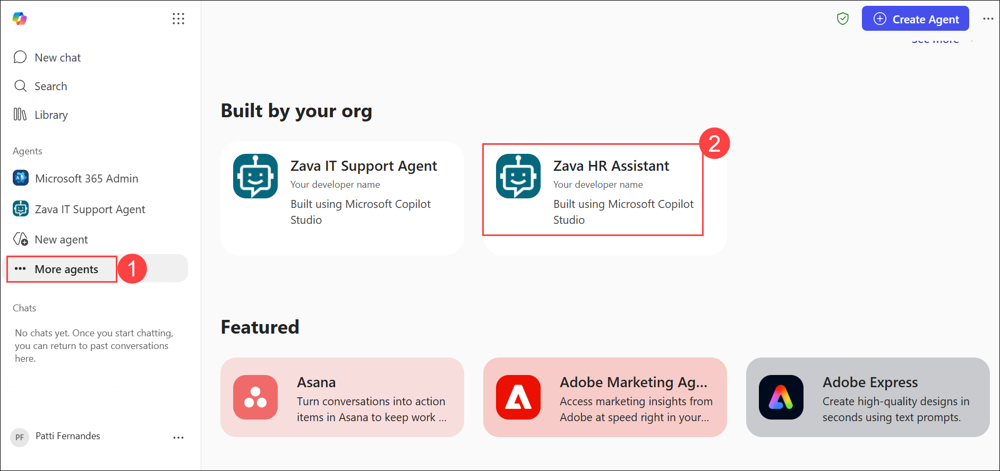

1. Select **Open** to launch the **Zava HR Assistant** agent.

	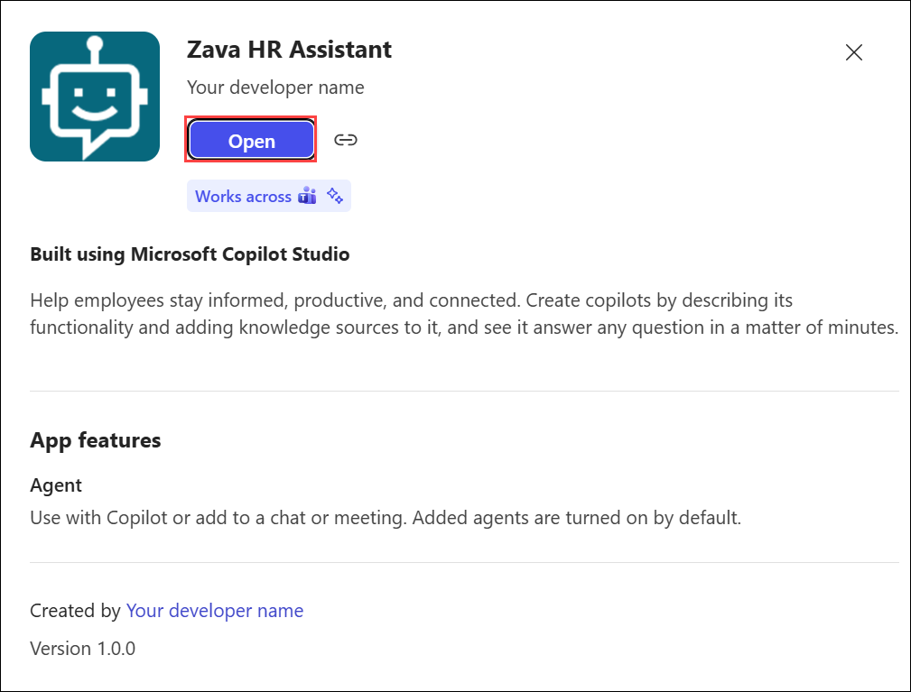

1. In the chat input field, enter the following:

   ```
   What is Zava's leave policy?
   ```

1. Wait for the Zava HR Assistant to respond.

	
1. Enter a second message in the chat input field:

   ```
   How do I submit a sick leave request?
   ```

1. Wait for the response.

	

    > **Note:** These interactions generate agent sign-in events as the Zava HR Assistant authenticates to access its SharePoint knowledge source. These events will appear in the Entra sign-in logs and will have Conditional Access policy evaluation recorded against them.

1. Close the InPrivate browser window.

### Task 2: Investigate Agent Sign-In Logs in Entra

1. Return to the **ODL User** browser session at Microsoft Entra admin center 

    ```
    https://entra.microsoft.com
	```

1. In the left navigation pane, expand **Entra ID** and Select **Sign-in logs** under **Monitoring & health**.

	

1. On the **Sign-in logs** page, select the **Service principal sign-ins** tab.

	

1. In the filter bar, select **+ Add filters**. Select **Is Agent** as the filter field.

	

1.  Select **Yes** and then click **Apply** to apply the filter.

	

1. Review the sign-in entries returned in the filtered view.

	

## Summary

In this lab, you created a custom security attribute set named **AgentAttributes** with an **AgentApprovalStatus** attribute containing five predefined governance values. You assigned the **HR_Approved** approval status to the Zava HR Assistant, establishing a structured agent classification model in Entra ID. You created the **Zava - Block Unapproved Agent Identities** Conditional Access policy targeting all agent identities and excluding those with approved attribute values. You used the What If tool in Report-only mode to validate that an approved agent is correctly excluded from the block policy, then switched the policy to enforcement mode. You created the **Zava - Block High Risk Agent Identities** policy using Entra ID Protection agent risk signals and set it to Report-only pending risk signal generation. Patti Fernandes invoked the Zava HR Assistant to generate sign-in events, which you then investigated in the Service principal sign-in logs filtered by agent type. Zava's agent identities are now governed by Zero Trust Conditional Access controls.
