# Lab 04: Microsoft Purview - Sensitivity Labels and DLP for Copilot

### Estimated time: 30 Minutes

## Introduction

Zava's information security team has identified that the Zava Finance Agent and Zava HR Assistant can retrieve and surface content from SharePoint without any awareness of how sensitive that content is. The CISO has mandated that all sensitive HR and financial documents must be labelled before the end of Day 2, and that Microsoft 365 Copilot must be prevented from processing documents labelled as confidential HR data.

Zava Corporation handles sensitive employee records, financial data, and vendor contracts across SharePoint sites that are now connected to AI agents. Without sensitivity labels and Data Loss Prevention policies, these agents can surface protected content to any user who asks - regardless of their access rights or data handling obligations.

In this lab, you will enable sensitivity label support for SharePoint and OneDrive, build Zava's label taxonomy using a label group and child labels, configure auto-labelling for financial data, publish labels to users, and create a DLP policy that prevents Microsoft 365 Copilot from processing labelled content. Patti Fernandes will test whether Copilot is blocked from surfacing labelled content and audit trail.

## Objectives

- Enable sensitivity label co-authoring support for SharePoint and OneDrive.
- Create a Zava label group and two child labels for HR and Financial data.
- Configure an auto-labelling policy to automatically apply the Financial Data label to content containing financial sensitive information types.
- Publish both labels to all Zava users.
- Apply the HR Data label manually to Zava HR SharePoint files.
- Create a DLP policy targeting the Microsoft 365 Copilot location to block processing of HR-labelled content.
- Test DLP enforcement as Patti Fernandes via Microsoft 365 Copilot Chat.
- Investigate the DLP match audit event as Patti Fernandes in Purview Audit.

## Exercise 1: Enable Sensitivity Label Support for SharePoint and OneDrive

### Task 1: Enable Co-Authoring for Files with Sensitivity Labels

1. Open a new tab and enter the following URL to navigate to the **Purview portal**. 

     ```
	 https://purview.microsoft.com
	 ```

1. Sign in with following  credentials:

	- **Email/Username:** **<inject key="AzureAdUserEmail"></inject>**

	- **Password:** **<inject key="AzureAdUserPassword"></inject>** 

1. In the left navigation pane, select **Settings**. Under **Solution Settings**, select **Information Protection**.

	

1. On the **Information Protection settings** page, select the **Co-authoring for files with sensitivity labels** tab.

1. Select the checkbox for **Turn on co-authoring for files with sensitivity labels** if not already turned on.

	

	 - Select **Apply** at the bottom of the page.

	    

		 > **Note:** Enabling co-authoring also activates sensitivity label support for files stored in SharePoint and OneDrive. This is a prerequisite for applying labels to SharePoint-hosted files and for Defender for Cloud Apps to scan files for label metadata. Without this setting, the Sensitivity button will not appear in Office for the web.

## Exercise 2: Create the Zava Sensitivity Label Taxonomy

### Task 1: Create the Zava-Confidential Label Group

1. In the left navigation pane of the Microsoft Purview portal, select **Information Protection** from **Solutions**.

	

2. From left sub-navigation, select **Sensitivity labels**.

	

3. If asked, select **Get started** for migrating to the new label scheme.

	  

	- On Migrate to the modern label scheme pane, select **Migrate**.

	   

	- On confirmation pop-up click on **Confirm migration**.	 

	   

5. On the **Sensitivity labels** page, select **+ Create (1)** and then click **Label group (2)**.

	

6. On the **New label group** configuration page, on the **Provide basic details for this label group** step, enter the following:

   - **Name:** `Zava-Confidential` **(1)**
   - **Display name:** `Zava-Confidential` **(2)**
   - **Description for users:** `Use this label group for all Zava confidential content requiring restricted handling.` **(3)**
   - **Description for admins:** `Zava confidential label group. Contains child labels for HR and Financial data classifications.` **(4)**

7. Select **Next (5)**.

	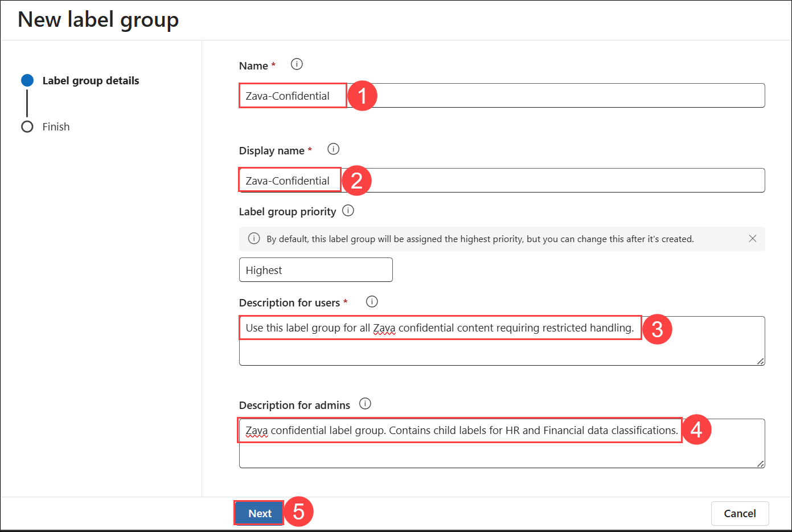

8. On the **Review your settings and finish** page, select **Create label group**.

	

9. On the **Your label group was created successfully** page, select **Dont create a label yet** and click on **Done**.

	

10. Confirm that **Zava-Confidential** appears in the label list.

	


### Task 2: Create the HR Data Child Label

1. Select the **More actions** (**⋮**) **(1)** menu for the **Zava-Confidential** label group, and then select **+ Create label in group (2)**.

	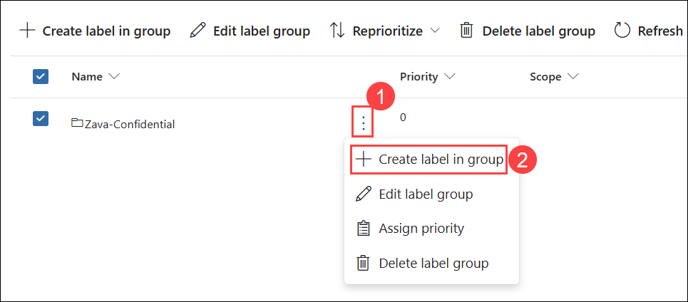

1. On the **Provide basic details for this label** page, enter the following:

    - **Name:** `HR-Data` **(1)**

    - **Display name:** `HR-Data` **(2)**

    - **Description for users:** `Apply this label to documents containing Zava employee data including personnel files, payroll records, sick leave reports, and termination documentation.` **(3)**

    - **Description for admins:** `Child label of Zava-Confidential. Used to classify HR documents on the Zava HR SharePoint site. Triggers DLP enforcement in Microsoft 365 Copilot.` **(4)**

3. Select **Next (5)**.

	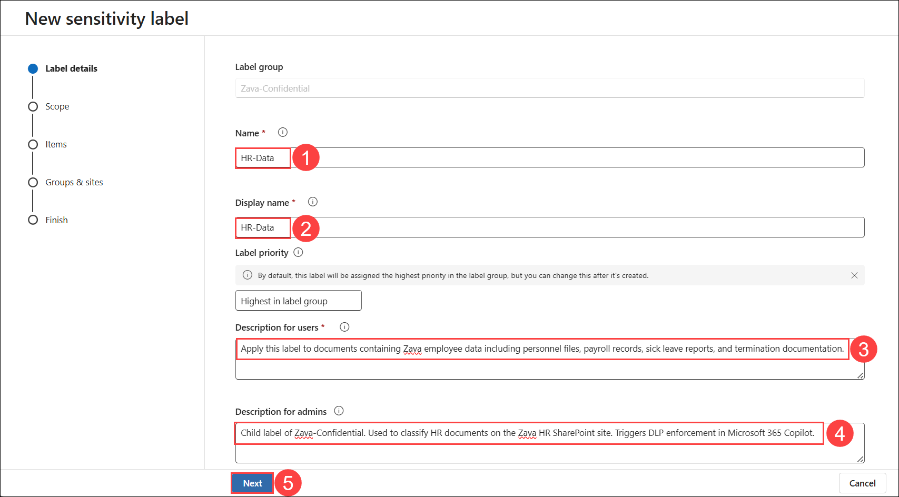

4. On the **Define the scope for this label** page, select **Files & other data assets** and **Emails**. Ensure **Meetings** is deselected and click **Next**.

	

5. On the **Choose protection settings for labeled items** page, select **Apply content marking** and click **Next**.

	

6. On the **Content marking** page, set the **Content marking** toggle to **On**. Select the checkbox for **Add a header**.

	

7. Select the edit icon below to **Add a header**.

	

9. In the **Header text** field, enter `ZAVA CONFIDENTIAL - HR DATA` and click **Save**.

	

10. Select the edit icon below to **Add a footer**.

	

11. In the **Footer text** field, enter `Restricted - Zava HR use only` and click **Save**.

	

12. Select **Next**.

	

13. On the **Auto-labeling for files and emails** page, select **Next**.

	

14. On the **Define protection settings for groups and sites** page, select **Next**.

	

15. On the **Review your settings and finish** page, select **Create label**.

	

16. On the **Your sensitivity label was created** page, select **Don't create a policy yet** and click **Done**.

	


### Task 3: Create the Financial Data Child Label with Auto-Labelling

1. Select the **More actions** (**⋮**) **(1)** menu for the **Zava-Confidential** label group, and then select **+ Create label in group (2)**.

	

1. On the **Provide basic details for this label** page, enter the following:

    - **Name:** `Financial-Data` **(1)**

    - **Display name:** `Financial-Data` **(2)**

    - **Description for users:** `Apply this label to documents containing Zava financial data including invoices, budgets, expense reports, credit card numbers, or bank account information.` **(3)**

    - **Description for admins:** `Child label of Zava-Confidential. Used to classify financial documents on the Zava Finance SharePoint site. Configured with auto-labelling for credit card numbers, ABA routing numbers, and SWIFT codes.` **(4)**

1. Select **Next (5)**.

	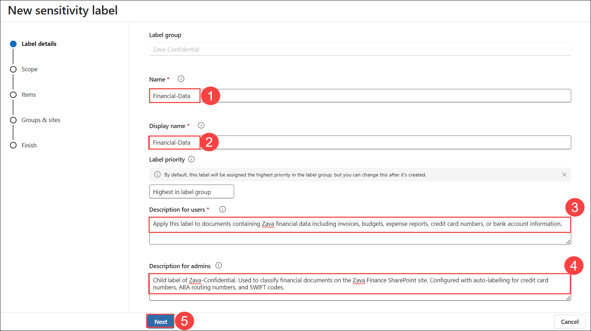

1. On the **Define the scope for this label** page, select **Files & other data assets** and **Emails**. Ensure **Meetings** is deselected and click **Next**.

	

1. On the **Choose protection settings for labeled items** page, select **Apply content marking** and click **Next**.

	

1. On the **Content marking** page, set the **Content marking** toggle to **On**.

1. Select the edit icon below to **Add a footer**.

	

1. In the **Footer text** field, enter `Restricted - Zava Finance use only`. Select **Save**.

	

1. Click **Next**.

	

1. On the **Auto-labeling for files and emails** page, set the **Auto-labeling for files and emails** toggle to **On**.

	

1. Under **Detect content that matches these conditions**, select **+ Add condition** and click **Content contains**.

	

1. In the **Content contains** section, select **Add (1)** and click **Sensitive info types (2)**.

	

1. On the **Sensitive info types** flyout panel, search for and select the following **sensitive info types (1)**:

    - `Credit Card Number`
    - `ABA Routing Number`
    - `SWIFT Code`

1. Select **Add (2)** to confirm the selection.

	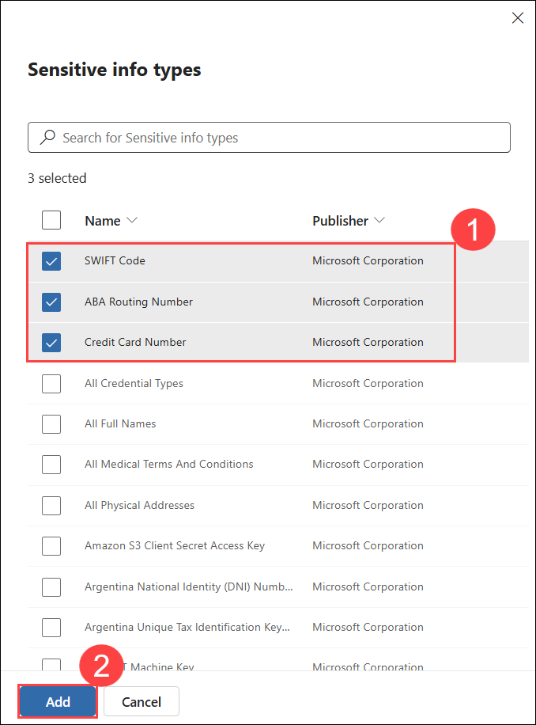

1. Click **Next**.

	

1. On the **Define protection settings for groups and sites** page, Click **Next**.

	

1. On the **Review your settings and finish** page, click **Create label**.

	

1. On the **Your sensitivity label was created** page, select **Automatically apply label to sensitive content (1)** and click **Done (2)**.

	

1. On the **Create auto-labeling policy** flyout page, select **Review policy**.

	


### Task 4: Configure and Save the Financial Data Auto-Labelling Policy

1. On the **Name your auto-labeling policy** page, confirm the default name reflects **Financial-Data auto-labeling policy**, then select **Next**.

	

1. On the **Choose a label to auto-apply** page, confirm that **Zava-Confidential/Financial-Data** is selected, then click **Next**.

	

1. On the **Assign admin units** page, select **Next**.

	

1. On the **Choose locations where you want to apply the label** page, select the following locations:

   - **Exchange email**
   - **SharePoint sites**
   - **OneDrive accounts**

1. Select **Next**.

	

1. On the **Set up common or advanced rules** page, leave **Common rules** selected, then click **Next**.

	

1. On the **Define rules for content in all locations** page, expand the **Financial-Data rule** to confirm that Credit Card Number, ABA Routing Number, and SWIFT Code are listed as conditions.

1. Select **Next**.

	

1. On the **Additional label settings** page, select **Next**.

	

1. On the **Decide if you want to test out the policy now or later** page, select **Run policy in simulation mode (1)** and enable the checkbox for **Automatically turn on policy if not modified after 7 days in simulation**.

1. Select **Next (2)**.

	

1. On the **Review and finish** page, select **Create policy**.

	

1. On the **Your auto-labeling policy was created** page, select **Done**.

	

     > **Note:** The auto-labeling policy will scan existing content in SharePoint, OneDrive, and Exchange in simulation mode. The `Zava_Expense_Report_Alex.xlsx`, `Zava_Payroll_Q1_2025.xlsx`, and `Zava_Invoice_Log.xlsx` files uploaded in Lab 00 contain credit card numbers and IBAN values and will be matched by this policy. After 7 days in simulation without modification, the policy will turn on automatically and begin applying the Financial-Data label to matched files.

## Exercise 3: Publish Sensitivity Labels to Zava Users

### Task 1: Publish the Zava-Confidential Labels

1. On the **Sensitivity labels** page, select **Publish labels**.

	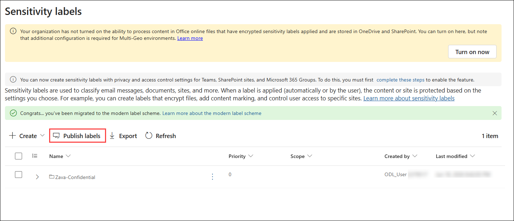

1. On the **Choose sensitivity labels to publish** page, select **Choose sensitivity labels to publish**.

	

1. On the **Sensitivity labels to publish** flyout panel, select the checkboxes for both of the following labels **(1)**:

   - **Zava-Confidential/HR-Data**
   - **Zava-Confidential/Financial-Data**

1. Select **Add (2)** at the bottom of the flyout panel.

	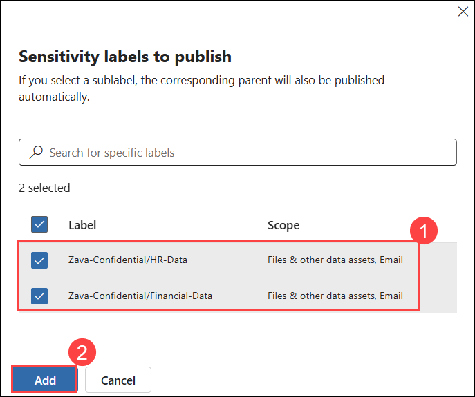

1. Back on the **Choose sensitivity labels to publish** page, select **Next**.

	

1. Then select **Next** until you reach the **name** page.

1. On the **Name your policy** page, enter the following:

    - **Name:** `Zava-Confidential Label Policy` **(1)**

    - **Description:** `Publishes Zava-Confidential HR-Data and Financial-Data labels to all Zava users for manual and auto-labelling of sensitive content.` **(2)**

1. Select **Next (3)**.

	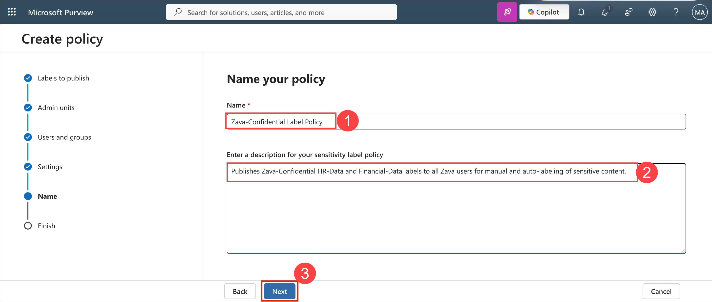

1. On the **Review and finish** page, select **Submit**.

	

1. On the **New policy created** page, select **Done**.

	

    > **Note:** Label policy propagation can take 2 to 24 hours before the Sensitivity button appears in Office for the web for all users. In this lab, you will apply labels directly via the SharePoint document library sensitivity column in the next exercise, which does not depend on the Office app Sensitivity button.

## Exercise 4: Apply the HR-Data Label to Zava HR SharePoint Files

### Task 1: Apply Sensitivity Labels via SharePoint Document Library

1. Open a new browser tab and navigate to **https://[TenantName].sharepoint.com/sites/HR<inject key="Deployment ID" enableCopy="false"></inject>**.

   > **Note:** Replace `[TenantName]` with your tenant prefix from the **Resources** tab.

3. Select **Documents** from the left navigation, and locate **Zava_Employee_Records.xlsx**. Select the checkbox to the left of **Zava_Employee_Records.xlsx** to select it.

	

4. In the toolbar above the document library, select **⋯** (More options) or the **Details** pane icon.

	

5. On the **Details** pane or right-click context menu, select the **Sensitivity (1)** field and then select **Zava-Confidential/HR-Data (2)** from the dropdown list.

	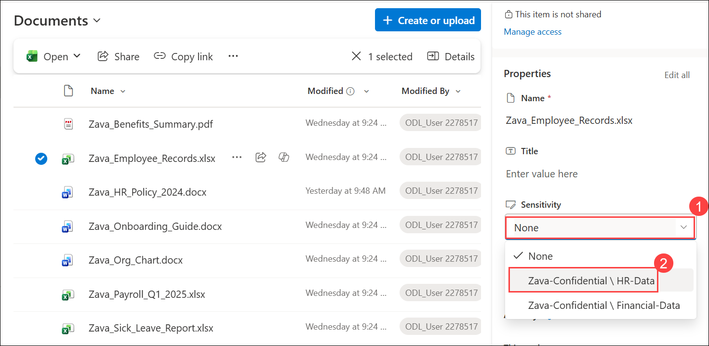

	 > **Note:** Label policy propagation should be in completed and in Ready state before the Sensitivity button appears in Office for the web for all users. This might take 2 to 24 hours. In the meantime you can proceed with Exercise 5.

6. Repeat steps 3 to 5 for the following files:

   - `Zava_Payroll_Q1_2025.xlsx`
   - `Zava_Sick_Leave_Report.xlsx`
   - `Zava_Termination_Checklist.docx`

7. Confirm that all four files show **Zava-Confidential/HR-Data** in the **Sensitivity** column.

    > **Note:** If the Sensitivity column is not visible in the document library, select **Add column** from the column header row and add the **Sensitivity** column. If the sensitivity label options do not appear yet due to propagation delay, wait 15–30 minutes and retry. Alternatively, open each file in Office for the web, select **Sensitivity** from the ribbon, and apply the label from within the document.

## Exercise 5: Create a DLP Policy for Microsoft 365 Copilot

### Task 1: Create the DLP Policy

1. Return to the Microsoft Purview portal at `https://purview.microsoft.com`. In the left navigation pane, select **Data Loss Prevention** from **Solutions**.

	

1. From the left sub-navigation of **Data Loass Prevention**, select **Policies (1)**, then **+ Create policy (2)** on the Policies page.

	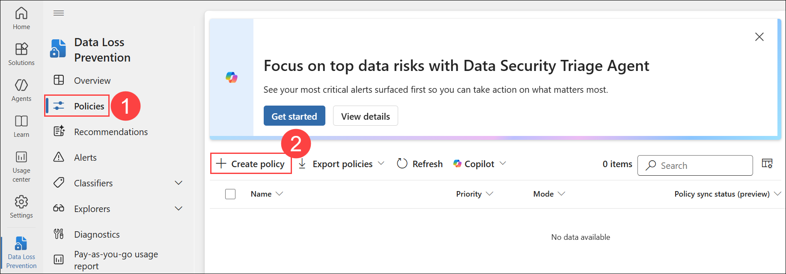

1. For the **What info do you want to protect?** pane, select **Enterprise applications and devices**.

	

1. On the **Start with a template or create a custom policy** page, under **Categories**, select **Custom (1)**. Then, under Regulations, select **Custom policy (2)**, and click **Next (3)**.

	

1. On the **Name your DLP policy** page, enter the following:

   - **Name:** `Zava - Block HR Data in M365 Copilot` **(1)**

   - **Description:** `Prevents Microsoft 365 Copilot and Copilot Chat from processing or surfacing documents labelled as Zava-Confidential HR-Data.` **(2)**

1. Select **Next (3)**.

	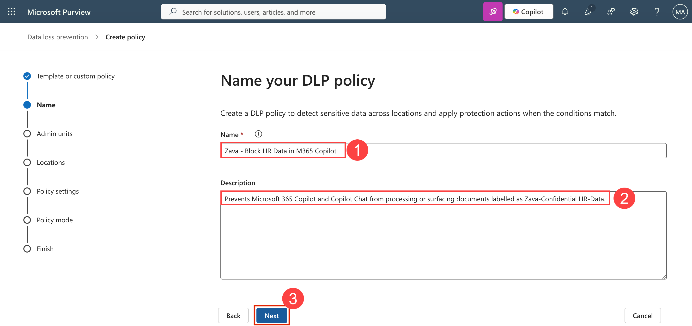

1. On the **Assign admin units** page, select **Next**.

	

1. On the **Choose locations to apply the policy** page, deselect all locations that are toggled on by default.

1. Locate **Microsoft 365 Copilot and Copilot Chat** in the locations list. Toggle **Microsoft 365 Copilot and Copilot Chat** to **On**.

	

11. Confirm that all other locations remain toggled **Off**.

1. Select **Next**.

    > **Note:** The Microsoft 365 Copilot and Copilot Chat location applies DLP policy controls to interactions in Microsoft 365 Copilot Chat and Copilot-powered experiences. It does not apply to Copilot Studio custom agents accessed directly. The test in Exercise 6 will use M365 Copilot Chat at copilot.microsoft.com, not the Zava HR Assistant directly, to validate enforcement.

	

1. On the **Define policy settings** page, select **Create or customize advanced DLP rules (1)**. Select **Next (2)**.

	

1. On the **Customize advanced DLP rules** page, select **+ Create rule**.

	

1. On the **Create rule** panel, configure the following details: 

    - **Name**: Enter **Block Copilot access to HR-labelled content (1)**

	- **Description**: Enter `Blocks Microsoft 365 Copilot from processing files labelled Zava-Confidential/HR-Data.` **(2)**  

1. Under **Conditions**, select **+ Add condition (3)**. Select **Content contains (4)**.

	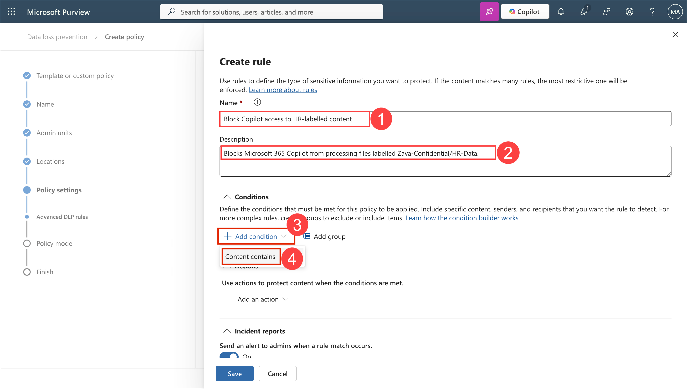

18. In the **Content contains** section, click **Add (1)** and Select **Sensitivity labels (2)**.

	

19. On the **Sensitivity labels** flyout panel, search for and select **Zava-Confidential/HR-Data (1)** and click **Add (2)** to confirm.

	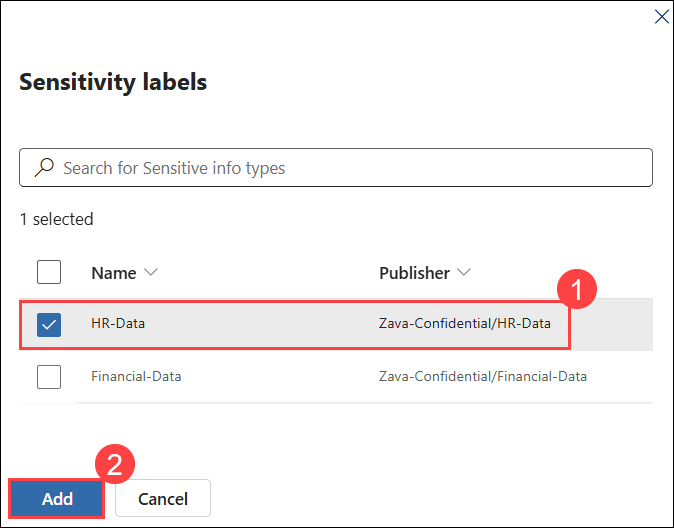

20. Under **Actions**, click **+ Add an action (1)** and select **Restrict Copilot from processing contents (2)**.

	

21. Under **Restrict Copilot from processing contents**, select the checkbox next to **Accessing knowledge sources (1)**.

22. Select **Save (2)** to save the rule.

	

23. Confirm that **Block Copilot access to HR-labelled content** appears in the rules list on the **Customize advanced DLP rules** page. Select **Next**.

	

24. On the **Policy mode** page, select **Turn the policy on immediately (1)** and click **Next (2)**.

	

25. On the **Review and finish** page, review the policy configuration and click **Submit**.

	

26. On the **New policy created** page, select **Done**.

	

27. On the **Policies** page, confirm that **Zava - Block HR Data in M365 Copilot** appears in the list with a status of **On**.

	

   	> **Note:** DLP policy propagation to the Microsoft 365 Copilot location can take up to four hours. If the test in Exercise 6 does not produce a block immediately, this is expected. Proceed with the test, note the response, and if enforcement is not yet active, return to this test after completing Lab 05 or at the end of the day. The audit log event will confirm when enforcement first triggers.


## Exercise 6: Test DLP Enforcement via Microsoft 365 Copilot Chat

### Task 1: Attempt to Access HR-Labelled Content as Patti Fernandes

1. Open a new **InPrivate** or **Incognito** browser window. Navigate to Copilot studio and Click on **Sign in**.

    ```
    https://copilot.microsoft.com
    ```

   

1. Click on **Continue with Microsoft.**

   

3. Sign in with **Patti Fernandes** credentials from the **Environment** tab.

	- **Email:** <inject key="User 01 UPN"></inject>

	- **Password:** <inject key="User's Password"></inject>

1. Click on the **Work** Tab on the **Which Copilot experience are you looking for?**.

	

4. In the Microsoft 365 Copilot Open **Zava HR Assistant** Chat input field, enter the following prompt:

   ```
   Summarise the contents of Zava_Employee_Records.xlsx
   ```

	

5. Wait for the response.

6. Review the response carefully:

   - **If DLP is enforced:** Copilot will return a response indicating that it cannot access or share the content due to a data protection policy. A policy tip may be visible.
   - **If DLP propagation is still in progress:** Copilot may return a partial summary or a reference link to the file. Note the response and return to this step after completing Lab 05.

	

7. Enter a second prompt:

   ```
   What employee salary information is in the HR SharePoint site?
   ```

8. Review the response and note whether Copilot restricts or surfaces the content.

	

9. Close the InPrivate browser window.

## Exercise 7: Investigate the DLP Match Event in Purview Audit

### Task 1: Search for DLP Match Events as Patti Fernandes

1. Open a new **InPrivate** or **Incognito** browser window.

2. Navigate to **Microsoft Purview** using the below URL.

    ```
	https://purview.microsoft.com
	```

3. Sign in with **Patti Fernandes** credentials from the **Envirnoment** tab.

	- **Email:** <inject key="User 01 UPN"></inject>

	- **Password:** <inject key="User's Password"></inject>

4. In the left navigation pane, Select **Audit** from **Solutions**.

	

7. Configure the search with the following values:

   - **Start date (1):** Select today's date minus 1 day.

   - **End date (2):** Select today's date.

   - **Activities - friendly names (3)**: select **Matched DLP rule** from the dropdown.

8. Select **Search (4)**.

	

9. Wait for the search job to complete.

    > **Note:** If no DLP match events appear in the audit log yet, this indicates that either the DLP policy has not yet propagated fully or that the test interaction in Exercise 6 did not trigger enforcement. DLP audit events for the Copilot location can take up to one hour to appear in the audit log after enforcement occurs. Return to this search after completing Lab 05 if results are not yet available.

14. Close the InPrivate browser window.


## Summary

In this lab, you enabled sensitivity label co-authoring support in Microsoft Purview, activating label awareness for SharePoint and OneDrive files. You created the **Zava-Confidential** label group and two child labels - **HR-Data** and **Financial-Data** - with content markings to identify classified documents. You configured an auto-labelling policy for Financial-Data that detects credit card numbers, ABA routing numbers, and SWIFT codes in SharePoint, OneDrive, and Exchange, running in simulation mode with automatic enforcement after seven days. You published both labels to all Zava users via the **Zava-Confidential Label Policy**, and manually applied the **HR-Data** label to four sensitive HR documents in the Zava HR SharePoint site. You created the **Zava - Block HR Data in M365 Copilot** DLP policy targeting the Microsoft 365 Copilot and Copilot Chat location, blocking access to any content carrying the HR-Data label. Patti Fernandes tested whether Microsoft 365 Copilot could surface labelled HR content, and Patti Fernandes searched the Purview Audit log for the resulting DLP match event. Zava's sensitive data is now classified, and Microsoft 365 Copilot is governed by policy-based access controls.
