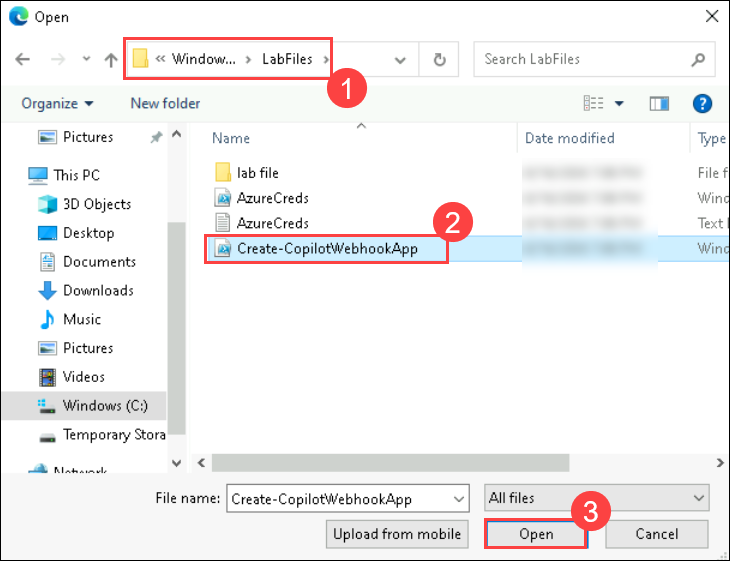
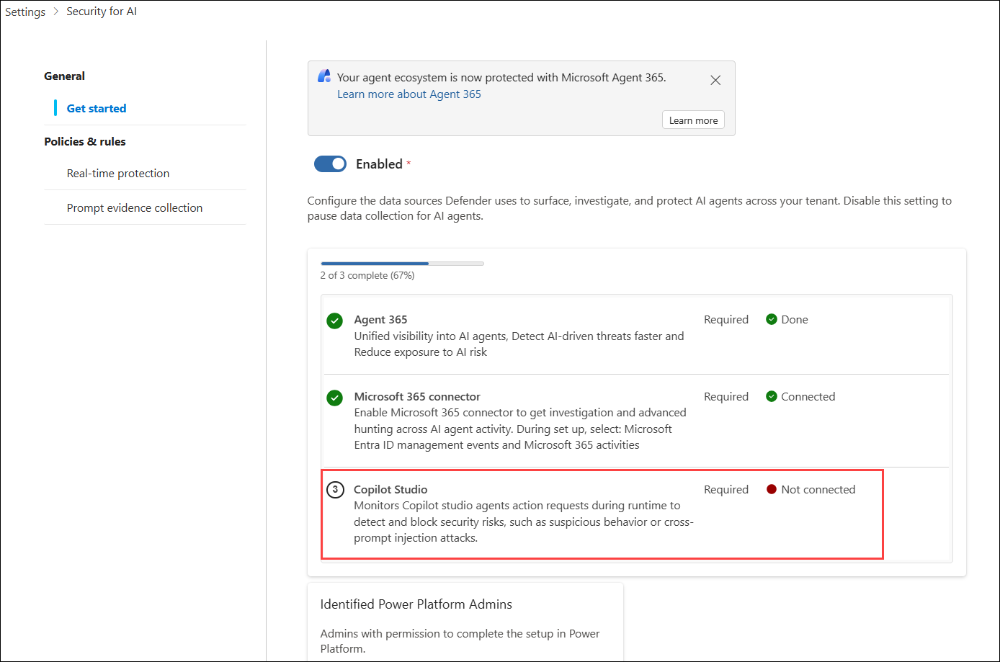
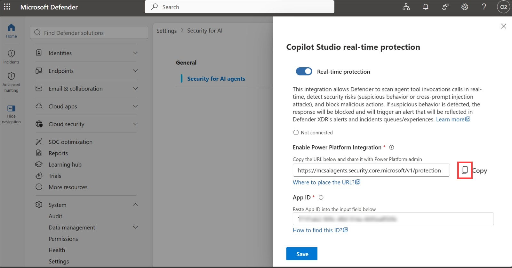
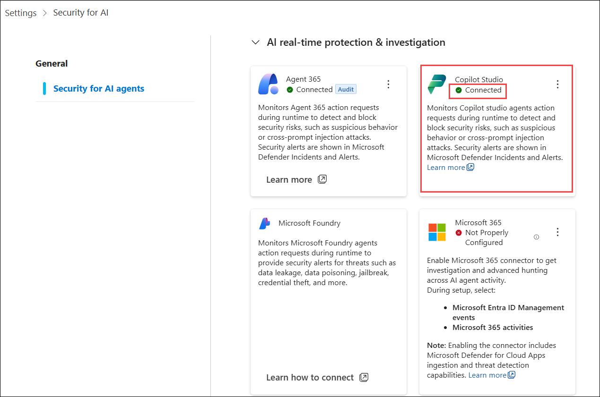

# Lab 05: Microsoft Defender - AI Agent Inventory and Threat Hunting

### Estimated time: 60 Minutes

## Introduction

Microsoft Defender for Cloud Apps provides a dedicated AI agent inventory that discovers all Copilot Studio custom agents in the tenant and exposes them for security investigation. Combined with the Advanced Hunting `AIAgentsInfo` table in Microsoft Defender XDR, the security team can query agent configurations, detect misconfigurations, identify governance gaps, and proactively hunt for risky agent behaviour - all without leaving the Defender portal.

In this lab, you will enable Defender preview features, activate the Copilot Studio AI agent inventory, and connect it to Power Platform. Patti Fernandes will then explore the AI agent inventory, investigate Zava agent configurations, and run Advanced Hunting KQL queries to identify potential security risks across the Zava agent estate.

## Scenario

Zava's SOC team has been asked to confirm that all deployed AI agents are visible in the Defender portal and that the security team has the tooling in place to hunt for misconfigured or risky agents. Patti Fernandes will use the AI agent inventory to review Zava agent properties - including authentication type, knowledge sources, and owner assignments - and run a series of community and custom KQL queries to surface any configuration risks. Any findings will be documented for the CISO review at the end of Day 2.

## Objectives

- Enable Microsoft Defender preview features for Cloud Apps, Defender for Cloud, and Defender XDR.
- Enable the Copilot Studio AI agent inventory in Defender for Cloud Apps settings.
- Complete the AI agent inventory onboarding in Power Platform Admin Center.
- Confirm the green Connected status in the Defender portal.
- Explore the AI agent inventory and review Zava agent details.
- Use Go hunt to open Advanced Hunting pre-filtered for a specific agent.
- Run community queries from the AI Agents folder to identify unauthenticated and misconfigured agents.
- Run a custom KQL query to review all Zava agent configurations in a single view.
- Review the Defender Alerts queue for Cloud Apps agent-related activity.

## Exercise 1: Enable Defender Preview Features

### Task 1: Enable Preview Features in Microsoft Defender XDR

1. Open a browser and navigate to **Microsoft Defender** using the URL

    ```
    https://security.microsoft.com
    ```

2. Sign in with **ODL User** credentials if prompted.

3. In the left navigation pane, expand **System (1)** and select **Settings (2)**.

4. On the **Settings** page, select **Microsoft Defender XDR (3)**.

   

5. In the left sub-navigation, select **Preview features**.

   

6. On the **Preview features** page, set the **Preview features** toggle to **On** if not already done.

   - Make sure the checkbox for **Microsoft Defender XDR** and **Microsoft Defender for cloud apps** is enabled

      

   - Select **Save preferences**.

        

   - Confirm that a success notification appears.

        


## Exercise 2: Enable the Copilot Studio AI Agent Inventory

### Task 1: New App registration in azure portal

1. Navigate to azure portal using the URL and Sign in with **ODL User** credentials if prompted.

    ```
    https://portal.azure.com
    ```

1. Select the Cloud Shell icon from the upper-right corner of the page to launch an Azure Cloud Shell session.

   

    >**Note**: If prompted, complete the Cloud Shell initialization before proceeding

1. Click on **Manage Files** and select **Upload** 

    

    - In the **C:\LabFiles (1)** folder, select the **Create-CopilotWebhookApp.ps1 (2)** script and then select **Open (3)**.

       
    
    - Make sure script is uploaded by the confirmation pop-up

       


1. Execute the following command in the cloudshell :

    ```
    .\Create-CopilotWebhookApp.ps1 -TenantId "<Paste your TenantId>" -Endpoint "https://mcsaiagents.security.core.microsoft/v1/protection" -DisplayName "Copilot Security Integration - Production" -FICName "ProductionFIC"
    ```

    >**Note:** Replace the **TenantId** in the command before running it in the clodshell. Follow the steps below to copy the Tenant ID: 

     - Navigate **Microsoft Entra ID** on the azure portal

        

      - Copy **Tenant ID** to use in the command

        

   

1. Navigate to the link and paste the code to complete the authentication

   

1. Copy the **App ID** and paste it in the **Notepad** as it will be used in task while connecting Copilot and Defender.

   

### Task 2: Connect Defender and Copilot studio

1. Navigate back to **Settings** and select **Security for AI**.

   

4. Scroll down and find **Copilot Studio** and click on **Connect** to begin the integration setup.

   

5. In the Copilot Studio real-time protection pane, verify that Real-time protection is enabled and review the generated Power Platform Integration URL.

   

1. In the **Copilot Studio real-time protection** pane, select **Copy** to copy the **Power Platform integration URL** for use in the Power Platform admin center.

      

6. Enter the required **App ID** in the App ID field and click **Save** to complete the Copilot Studio real-time protection configuration.

   

   

   > **Note:** Enabling this setting initiates the connection between Defender for Cloud Apps and Copilot Studio. The second step in Power Platform Admin Center must be completed before the green Connected status appears.


### Task 3: Complete Onboarding in Power Platform Admin Center

1. Open a new browser tab and navigate to **Power Platform** using the below URL.

    ```
    https://admin.powerplatform.microsoft.com
    ```

2. Sign in with **ODL User** credentials if prompted.
   - **Email/Username:** <inject key="AzureAdUserEmail"></inject>
   - **Password:** <inject key="AzureAdUserPassword"></inject>

3. In the left navigation pane, click **Security** and select **Threat Detection** and locate **Microsoft Defender - Copilot Studio Agents (Preview)**.

      

7. Set the **Enable Microsoft Defender - Copilot Studio Agents** toggle to **On** and click on **Manage**.

     

1. Select your **Dev** environment and click **Setup**

   

1. Enable the checkbox for **Allow Copilot Studio to share data with a threat detection partner** and enter the **Azure Entra App ID** and **Endpoint link** and click **save**

   
   
   >**Note:** Get Endpoint link and Entra App Id from the defender portal.

      


### Task 3: Confirm Connected Status in the Defender Portal

1. Return to the **ODL User** browser session at Defender Portal.

    ```
    https://security.microsoft.com
    ```

2. Navigate back to **Settings** and select **Security for AI**

   

6. Confirm that a green **Connected** indicator is displayed on the **Copilot Studio**.

   

   > **Note:** It can take time for the initial connection status to update after completing both onboarding steps.

## Exercise 3: Explore the AI Agent Inventory

### Task 1: Access the AI Agents Inventory

1. From the left navigation pane under **Assets**, select **AI Agents**.

   

    > **Note:** If **AI Agents** is not visible under Assets, confirm that preview features were enabled in Exercise 1 and that the inventory connection completed in Exercise 2. Wait up to 30 minutes after completing Exercise 2 before retrying.

1. On the **AI Agents** page, review the full list of agents discovered in the Zava tenant.

1. In the **Platform (1)** filter, select **Copilot Studio (2)** and **Apply (3)** to filter the view to Copilot Studio custom agents only.

   

1. Confirm that the following three agents appear in the inventory:

   | Agent Name | Status | Platform |
   | -----|------|---------|
   | Zava HR Assistant | Published | Copilot Studio |
   | Zava Finance Agent | Published | Copilot Studio |
   | Zava IT Support Agent | Published | Copilot Studio |

   

### Task 2: Review the Zava HR Assistant Agent Details

1. On the **AI Agents** page, select **Zava HR Assistant** to open its details panel.

   

1. On the details panel, review and note the following fields:

   - **Agent name**
   - **Status**
   - **Version**
   - **Publish Status**
   - **Model**
   - **Tools**
   - **Channels**
   - **Active alerts**
   - **Entra Agent ID**

     

### Task 3: Use Go Hunt to Open Advanced Hunting for the Zava HR Assistant

1. On the **Zava HR Assistant** details panel, Click **Go hunt** button or link.

   

1. Confirm that the browser navigates to **Investigation & response **(1)** > Hunting **(2)** > Advanced hunting (3)** with a pre-populated query scoped to the Zava HR Assistant agent.

   

1. Review the pre-populated query to understand its structure.

1. Select **Run query** to execute it.

   

1. Review the results returned in the query output panel.

   

## Exercise 4: Run Advanced Hunting Queries Against AIAgentsInfo

### Task 1: Sign In to the Defender Portal as Patti Fernandes

1. Open a new **InPrivate** or **Incognito** browser window.

2. Navigate to **Defender Portal** using the below URL.

    ```
    https://security.microsoft.com
    ```

3. Sign in with **Patti Fernandes** credentials from the **Resources** tab.

   - **Email:** <inject key="User 01 UPN"></inject>
   - **Password:** <inject key="User's Password"></inject>

4. In the left navigation pane, select **Investigation & response **(1)** > Hunting **(2)** > Advanced hunting (3)**.

   


### Task 2: Run a Custom Zava Agent Configuration Review Query

1. On the **Advanced hunting** page, select the **New query** tab to open a blank query editor.

   

2. In the query editor, enter the following KQL query:

   ```
   AgentsInfo
   | summarize arg_max(Timestamp, *) by AgentId
   | where LifecycleStatus != "Deleted"
   | where Name has_any ("Zava HR Assistant", "Zava Finance Agent", "Zava IT Support Agent")
   | project
       CreatedDateTime,
       Name,
       LifecycleStatus,
       PublishedStatus,
       Owners,
       SharedWith,
       Version,
       Model,
       LastUpdatedDateTime,
       Availability,
       Permissions
   | sort by CreatedDateTime asc
   ```

3. Select **Run query**.

   

4. Review the results returned for all three Zava agents.

   

6. Select **Save** to save the query.

   

7. In the **Save query** panel, enter the following and click **Save**

   - **Query name:** `Zava Agent Configuration Review`

   - **Location:** Select **My queries**.

   

   

## Exercise 5: Review the Defender Alerts Queue for Agent-Related Activity [Optional]

### Task 1: Filter the Alerts Queue by Cloud Apps Source

1. Remain signed in as **Patti Fernandes** in the Microsoft Defender portal.

1. In the left navigation pane, select **Incidents & alerts**.

1. Select **Alerts**.

1. On the **Alerts** page, select **Add filter**.

1. In the filter dropdown, select **Service source**.

1. Select **Microsoft Defender for Cloud Apps** as the filter value.

1. Select **Apply**.

1. Review the alerts returned in the filtered view.

1. If any alerts are present, select an alert to open its detail panel.

1. On the alert detail panel, review the following fields:

    - **Alert name**
    - **Severity**
    - **Status**
    - **Affected entity**
    - **Detection source**
    - **Activity log**

1. Close the alert detail panel.

    > **Note:** In a newly configured lab environment, the Cloud Apps alerts queue may be empty or contain only connector-related events. Agent-related alerts will begin appearing as the Zava agents are invoked, real-time protection signals are generated, and policy violations occur across Day 2 and Day 3 labs. This step establishes familiarity with the alerts queue that Patti will use for incident investigation in Day 3.

### Task 2: Check for Any Agent-Specific Incidents [Optional]

1. In the left navigation pane, select **Incidents & alerts**.

2. Select **Incidents**.

3. On the **Incidents** page, in the search bar, enter `Zava`.

4. Review any incidents returned that reference Zava agent activity.

5. If an incident is present, select it to open the incident detail page.

6. On the incident detail page, review the **Alerts** tab to see all alerts grouped into the incident.

7. Review the **Evidence and response** tab to see affected entities.

8. Close the incident and return to the **Incidents** page.

   > **Note:** If no Zava-related incidents appear, this is expected at this stage of the course. Note the search and filter techniques demonstrated here - they will be used in Day 3 when active threat investigation tasks are introduced.

## Summary

In this lab, you enabled Microsoft Defender preview features for Defender XDR and Defender for Cloud Apps, which are required to access the Copilot Studio AI agent inventory and the `AIAgentsInfo` advanced hunting schema. You enabled the Copilot Studio AI agent inventory in Defender for Cloud Apps settings and completed the corresponding onboarding step in Power Platform Admin Center to establish the data connection. You confirmed the green Connected status in the Defender portal. You explored the AI agent inventory under Assets, reviewed the Zava HR Assistant agent details including its authentication type, access control policy, knowledge sources, and owner assignments, and used the Go hunt action to open Advanced Hunting pre-filtered for that agent.

As Patti Fernandes, you ran two community queries from the AI Agents folder - detecting agents with no authentication and agents with hard-coded credentials - and reviewed the results against the Zava agent estate. You ran a custom Zava Agent Configuration Review KQL query to surface key security properties for all three Zava agents in a single view, and saved it for future use. You ran a second custom query to identify agents with overly broad access control policies. Finally, you reviewed the Defender Alerts queue filtered by Cloud Apps source and checked the Incidents page for any Zava-related activity, establishing the investigation baseline for Day 3.

Day 2 is now complete. Zava's agents are governed by Conditional Access policies, sensitive data is classified with Purview labels and protected by DLP controls, and the security team has full visibility into agent configurations and activity through the Defender AI agent inventory and Advanced Hunting.
