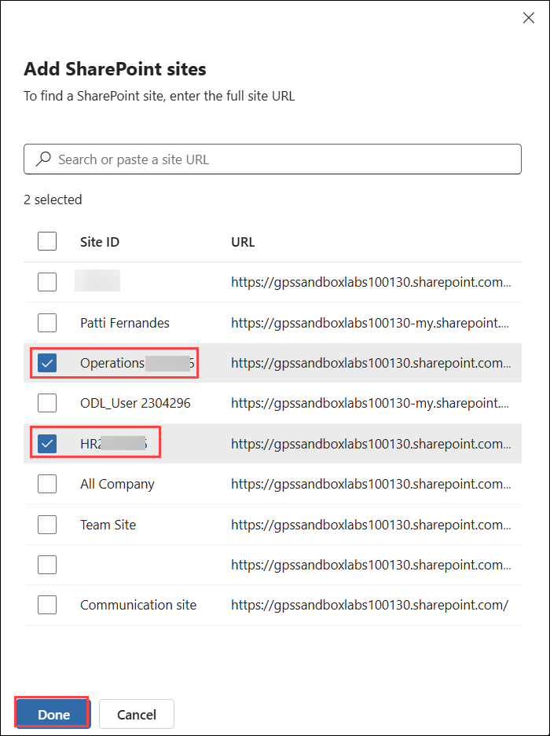
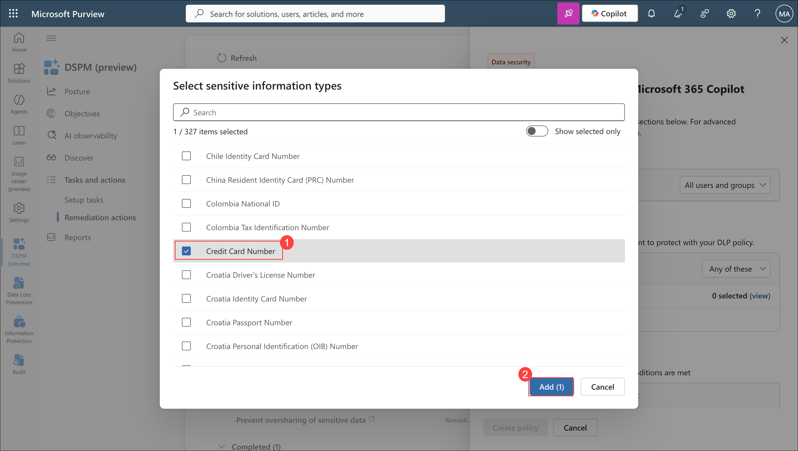

# Lab 06: DSPM - Oversharing Assessment and Remediation

### Estimated time: 25 Minutes

## Introduction

Microsoft Purview Data Security Posture Management is the unified front door for discovering, protecting, and investigating sensitive data risks across Zava's digital estate - including AI apps, agents, SharePoint sites, and user interactions. Unlike the classic DSPM for AI experience, the new DSPM combines traditional data security posture with AI observability into a single solution, organised around outcome-based security objectives.

In this lab, the data risk assessment scan is initiated at the very start of Day 3 before any other work begins, so results are available by the time learners reach Exercise 4. Signal generation exercises create realistic Copilot interaction events referencing sensitive Zava files. You and Patti Fernandes then use DSPM Objectives, one-click policies, assessment results, and the Activity Explorer to investigate and remediate oversharing risks across the Zava agent environment.

## Scenario

Zava's CISO has received a concern from the compliance team: the HR Assistant and Finance Agent may be surfacing sensitive employee and financial records to users who should not have access to that data. The security team needs to understand the full scope of data exposure, activate posture management policies, and apply remediation controls before the end of Day 3.

You will launch a custom data risk assessment against the Zava HR and Finance SharePoint sites, activate DSPM one-click policies, and use the Objectives dashboard to drive remediation. Adele Vance will generate realistic Copilot interaction signals referencing sensitive labelled files. Patti Fernandes will investigate the AI activities in DSPM Activity Explorer and review the oversharing findings from the assessment.

## Objectives

- Initiate a custom DSPM data risk assessment against Zava HR and Finance SharePoint sites at the start of Day 3.
- Generate realistic Microsoft 365 Copilot interaction signals referencing sensitive labelled files as Adele Vance.
- Navigate the new DSPM experience and review the Posture dashboard.
- Activate DSPM one-click policies for risky AI usage detection and sensitive data protection.
- Review DSPM Objectives for oversharing and Copilot data exposure.
- Review data risk assessment results and apply remediation actions.
- Investigate Zava agent activity and sensitive data access in the Apps and agents dashboard.
- Review AI interaction events in Activity Explorer filtered to Adele Vance.
- Apply SharePoint Restricted Content Discovery to the Zava HR site.


> ⚠️ **IMPORTANT - Complete Task 1 of Exercise 1 before anything else on Day 3.**
> The data risk assessment scan can take 30–60 minutes to complete. It must be started first so results are available when you reach Exercise 4. Do not proceed to Exercise 2 until Task 1 of Exercise 1 is complete.


## Exercise 1: Initiate the Data Risk Assessment

### Task 1: Register an Entra App

1. Navigate to **Entra admin center** using the below URL and Sign in with **ODL User** credentials if prompted.

    ```
    https://entra.microsoft.com
    ```

   - **Email/Username:** <inject key="AzureAdUserEmail"></inject>
   - **Password:** <inject key="AzureAdUserPassword"></inject>

2. In the left navigation pane, select **+ New registration** from **App registrations**.

	

3. Configure the following:
   - **Name:** `Purview DSPM Item Level Scan`
   - **Supported account types:** Select **Single tenant only**

4. Select **Register**.

	

5. On the app registration overview page, copy and note the **Application (client) ID**.

	

6. In the left sub-navigation, Select **+ Add a permission** from **API permissions**.

	

7. Select **Microsoft Graph**.

	

8. Under Microsoft Graph , Select **Application permissions**.

	

9. Search for and add the following permissions:
    - `Application.Read.All`
    - `Directory.Read.All`
    - `Files.ReadWrite.All`
    - `SensitivityLabels.Read.All`
    - `Sites.ReadWrite.All`
    - `User.Read.All`
    - `SensitivityLabel.Read`

10. Select **Add permissions**.

	

11. Select **Grant admin consent** to give the permission consent.

	

12. Select **Yes** to confirm.

	

13. Navigate to **Certificates & secrets** and click **+ New client secret** , set expiry to **6 months** and select **Add**.

	

14. Copy the **Value** from Client Secret.

	

15. Save the values, as they can only be copied once and will be needed in the next task.


### Task 2: Run a Custom Data Risk Assessment Against Zava SharePoint Sites

1. Open a browser and navigate to **Microsoft Purview** portal using the below URL and Sign in with **ODL User** credentials if prompted.

    ```
    https://purview.microsoft.com
    ```

   - **Email/Username:** <inject key="AzureAdUserEmail"></inject>
   - **Password:** <inject key="AzureAdUserPassword"></inject>

2. In the left navigation pane, select **DSPM** from **Solutions**.

   > **Note:** Do not select **DSPM for AI (classic)** or **Data Security Posture Management (classic)**. The new experience is labelled **DSPM** and is a separate entry in the Solutions menu.

	

3. On the **DSPM** landing page, if prompted to complete initial setup tasks, select **Get started** and accept any required configuration to enable the solution. Allow the setup to complete before continuing.

4. In the left sub-navigation, select **Data risk assessments** Under **Discover**

	

5. From the **Item-level scan not setup** notification, select **Setup connection**.

	

6. On the **Client Secret** tab, enter the **Application ID** and **Client secret (Value)** value copied in Task 1 step 14. Then select **Authenticate**. Once successful and click **Save**.

	

7. On the **Data risk assessments** page, select **+ Create custom assessment**.

	

8. On the **Basic details** panel, configure the following:

   - **Assessment name:** Enter `Zava SharePoint Oversharing Assessment`.
   - **Description:** Enter `Custom assessment to identify potentially overshared sensitive items across Zava HR and Finance SharePoint sites.`

9. Select **Next**.

	

10. On the **Select scan level**, choose **Item-level** and make sure all checkbos are enabled.

	

11. Select **Next** until you reach **Add data sources to assess** and select **Scope sites** , Next to **SharePoint**.

	

12. In the SharePoint site selector, click **Include** and select **From all sites**.

	

13. Search for and select the following two sites:

    - **HR<inject key="Deployment ID" enableCopy="false"></inject>**
    - **Operations<inject key="Deployment ID" enableCopy="false"></inject>**

14. Select **Done** to confirm the site selection.

	

	

15. Make sure only **SharePoint** is enabled and click **Next**.

	

16. Select **Save and Run**.

	

17. Click **Done**.

	

18. Confirm that the assessment appears in the **Data risk assessments** list with a status of **In progress** or **Queued**.

	

    > **Note:** The assessment will take time to complete depending on the number of items in the selected SharePoint sites.


## Exercise 2: Generate Copilot Interaction Signals

In this exercise, Patti Fernandes generates realistic Microsoft 365 Copilot interaction events that reference sensitive labelled files across the Zava HR and Finance SharePoint sites. These interactions will surface in the DSPM Activity Explorer and audit logs, creating the investigation data used in Exercises 5 and Lab 07.

### Task 1: Generate HR Data Interaction Signals as Patti Fernandes

1. Open a new **InPrivate** or **Incognito** browser window. Navigate to Copilot studio and Sign in with **Patti Fernandes** credentials from the **Resources** tab. Complete the authentication steps if necessary.

    ```
    https://copilot.microsoft.com
    ```

   - **Email:** <inject key="User 01 UPN"></inject>
   - **Password:** <inject key="User's Password"></inject>

2. From the navigation, click **All agents** and select **Zava HR Assistant** , click **Add**.

	

3. In the input field, enter the following prompt:

   ```
   Summarise the contents of Zava_Employee_Records.xlsx from the HR SharePoint site
   ```

4. Wait for the response and note what Copilot returns.

	

5. Enter the following second prompt:

   ```
   Find all employee salary information across Zava HR documents
   ```

6. Wait for the response.

	

7. Enter the following third prompt:

   ```
   What does the Zava payroll report for Q1 2025 contain?
   ```

8. Wait for the response.

	


## Exercise 3: Explore the DSPM Posture Dashboard and Activate One-Click Policies

### Task 1: Review the DSPM Posture Dashboard

1. Return to the **ODL User** session in the Microsoft Purview portal .

    ```
    https://purview.microsoft.com
    ```

2. In the left navigation pane, select **DSPM** from **Solutions** .

	

3. On the **DSPM** landing page, review the **Posture** dashboard.

	


### Task 2: Activate the Detect Risky AI Usage One-Click Policy

1. On the **DSPM** landing page, in the left sub-navigation, select **Tasks and actions** and click **Remediation actions**.

	

2. Select **Detect risky interactions in AI apps** to expand it.

   

3. Select **Create Policy** to enable the **DSPM for AI - Detect risky AI usage** Insider Risk Management policy.

	

4. Confirm that the policy status updates to **On** or **Active**. Close the tab.

	

   > **Note:** This Insider Risk Management policy detects risky prompts and responses in Microsoft 365 Copilot, agents, and other generative AI apps - including prompt injection attempts, accessing protected materials, and other high-risk interaction patterns. The Patti Fernandes interactions generated in Exercise 2 will be evaluated by this policy.


### Task 3: Activate the Sensitive Data Protection One-Click Policy

1. On the **Remediation actions** page, select **Safeguard sensitive data in Microsoft 365 Copilot interactions** to expand it.

	

2. Select **Get started** to enable this DLP policy.

	

3. On the data pane, confirm credit card is present in **Sensitive info types**.

	

4. If not present click **+ Add** and Select **Credit Card Number**. Then select **Add**.

	

5. Under **Actions**, select **Restrict user prompts from being processed**. Then select **Create policy**.

	

8. Confirm the policy is active.

	


## Exercise 4: Review Data Risk Assessment Results and Apply Remediation

> **Note:** Assessments may take some time. You can return to this exercise at the end of the labs if the assessment is still in progress.

### Task 1: Return to the Data Risk Assessment Results

1. In the left sub-navigation, Select **Data risk assessments** under **Discover**.

   

2. On the **Data risk assessments** page, locate **Zava SharePoint Oversharing Assessment**.

   

   >**Note** - It can take time get Completed maximum upto 24 hours

3. Confirm the status shows **Completed**. If the status still shows **In progress**, wait for it to complete before continuing.

4. Select **Zava SharePoint Oversharing Assessment** to open the results.


### Task 2: Review Overshared Items [Optional]

1. On the assessment results page, select the **Items** tab.

2. Review the list of potentially overshared items found across the Zava HR and Finance SharePoint sites.

3. Note the following for each item:

   - **File name**
   - **Sensitivity label** - confirm that HR-Data labelled files appear.
   - **Sharing scope** - note whether items are shared with **Everyone**, **All authenticated users**, or specific groups.
   - **Sensitive info types detected**

4. Locate **Zava_Employee_Records.xlsx** in the results and select it.

5. Review the item detail panel - note the sensitive info types detected, sharing permissions, and label applied.

6. Close the item detail panel.


### Task 3: Apply Remediation - Restrict Access by Label [Optional]

1. On the assessment results page, select the **Protect** tab.

2. Locate the **Restrict access by label** remediation action.

3. Select **Restrict access by label**.

4. On the remediation panel, confirm that **Zava-Confidential/HR-Data** is listed as the label to restrict.

5. Review the action - this will create or reference a DLP policy that restricts access to items carrying the HR-Data label.

6. Select **Apply** or **Confirm** to activate the remediation.

7. Confirm that the remediation action status updates to **Applied**.


### Task 4: Apply Remediation - Enable SharePoint Restricted Content Discovery [Optional]

1. On the **Protect** tab, locate the **Restrict all items** or **Enable Restricted Content Discovery** remediation action.

2. Select the action to open the configuration panel.

3. Review the description - SharePoint Restricted Content Discovery prevents items in the selected site from being surfaced in Microsoft 365 Copilot responses for users who do not have explicit access.

4. Confirm that the scope is set to the **Zava HR SharePoint site**.

5. Select **Apply** or **Enable** to activate Restricted Content Discovery for the Zava HR site.

6. Confirm that the action status updates to **Applied**.

   > **Note:** SharePoint Restricted Content Discovery is one of the most effective controls available to prevent AI agents and Copilot from surfacing content from a SharePoint site to users who lack explicit permission. This differs from DLP - it operates at the site discovery level rather than at the content classification level.


## Exercise 5: Investigate Agent Activity and AI Interactions

### Task 1: Review the Apps and Agents Dashboard

1. In the left sub-navigation,Select **Apps and agents** under **Discover**.

   

3. On the **Apps and agents** dashboard, review the list of AI apps detected across the tenant.

   

3. On the **Apps and agents** dashboard, select **Agents**.

   

6. Select **Zava HR Assistant** to open its agent details.

   


7. On the agent details panel, review the following:

   - **Sensitive data accessed** - types and volume of sensitive content the agent has referenced.
   - **Policy coverage** - which Purview policies are protecting data accessed by this agent.
   - **Users Risk And activity** - which users have interacted with this agent.

   

8. Close the agent details panel.


### Task 2: Investigate AI Activities in Activity Explorer [Optional]

1. In the left sub-navigation, select **Discover**.

2. Select **Activity explorer**.

3. On the **Activity explorer** page, select the **AI activities** tab.

4. In the filter bar, select **User** and enter `Patti Fernandes`.

5. Select **Apply** to filter results to Adele's interactions.

6. Review the interaction events listed in the filtered view.

7. Select an interaction event that references a sensitive file - for example, one referencing `Zava_Employee_Records.xlsx` or `Zava_Payroll_Q1_2025.xlsx`.

8. On the event detail panel, review the following fields:

    - **Date and time**
    - **User**
    - **Activity type**
    - **AI app**
    - **File referenced**
    - **Sensitivity label on file**
    - **DLP rule matched** - if applicable

9. Note whether the DLP policy **Zava - Block HR Data in M365 Copilot** appears as matched for any of the HR-labelled file interactions.

10. Close the event detail panel.

11. Remove the user filter and apply a filter for **Sensitivity label** set to **Zava-Confidential/HR-Data**.

12. Review the results - these show all AI interactions across the tenant that involved a file carrying the HR-Data label.


## Summary

In this lab, you initiated a custom DSPM data risk assessment against the Zava HR and Finance SharePoint sites at the start of Day 3, ensuring results were available for investigation later in the lab. You registered an Entra app and configured the item-level scan connection required by DSPM. As Patti Fernandes, you generated three realistic Microsoft 365 Copilot interaction events referencing sensitive labelled files including employee records, payroll data, and financial projections - creating the AI activity signals needed for investigation throughout Day 3.

You explored the DSPM Posture dashboard and reviewed its key metrics, top objectives, and Security Copilot suggested prompts. You activated two one-click policies: the DSPM for AI risky AI usage Insider Risk Management policy and the sensitive info detection DLP policy for Copilot interactions. You reviewed the data risk assessment results, identified overshared sensitive items in the Zava HR and Finance sites, and applied two remediation actions: restricting access by the HR-Data sensitivity label and enabling SharePoint Restricted Content Discovery on the Zava HR site. Finally you investigated Patti Fernandes Copilot interaction events in the DSPM Activity Explorer AI activities tab, reviewing file references, sensitivity labels, and DLP match records - building the evidence base for the Day 3 compliance review.
